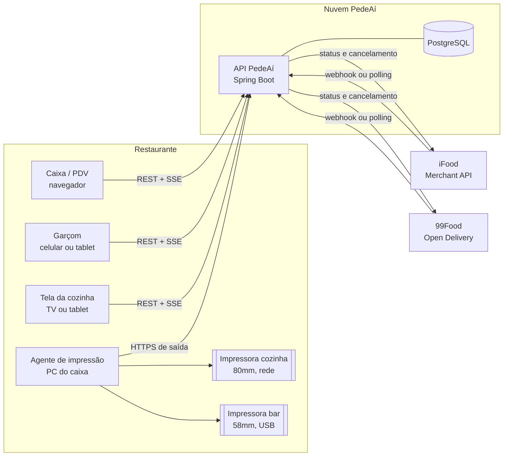

# PedeAí

Sistema de gestão de pedidos para restaurantes. Ele recebe pedidos de todos os
canais (balcão, telefone, mesa, iFood, 99Food), organiza, manda para a cozinha,
imprime nas impressoras térmicas certas e acompanha cada pedido até a entrega,
com uma visão financeira básica.

> **Status:** proposta de arquitetura. Ainda não há código. A implementação
> segue por etapas, descritas no [roadmap](docs/06-roadmap.md).

## Prioridades

1. Receber pedidos
2. Organizar pedidos
3. Preparar pedidos
4. Imprimir pedidos
5. Acompanhar pedidos
6. Integrar iFood e 99Food
7. Ter uma visão financeira básica

O PedeAí **não** é um ERP. Estoque, financeiro completo, delivery próprio,
emissão fiscal (NFC-e) e relatórios avançados ficam para depois. A arquitetura
já deixa o ponto de encaixe desses módulos, mas nada disso é construído agora.

## Visão geral



A arquitetura tem quatro peças:

1. **API**: um monolito modular em Spring Boot com PostgreSQL.
2. **SPA**: uma aplicação React usada no caixa, pelo garçom, na tela da cozinha e na gestão.
3. **Agente de impressão**: um programa pequeno instalado em um computador do
   restaurante. Ele busca os trabalhos de impressão no servidor e manda para as
   impressoras térmicas.
4. **Integrações**: iFood e 99Food entram no mesmo fluxo de pedido que os
   outros canais.

## Decisões principais

| Decisão | Por quê |
| --- | --- |
| **Monolito modular**, sem microserviços, sem fila externa | Um restaurante gera centenas de pedidos por dia, e mesmo mil lojas não pressionam um PostgreSQL bem indexado. Com menos peças, há menos coisas para cair na hora do jantar. |
| **Todo canal vira o mesmo `Pedido`** | Cozinha, impressão e acompanhamento não precisam saber de onde o pedido veio. Só o módulo de integração conhece o iFood e a 99Food. |
| **Impressão por agente local que se conecta *para fora*** | Imprime sozinho mesmo sem ninguém olhando a tela. Não abre porta no roteador e não depende de permissão do navegador. A instalação é um instalador e um código de pareamento. |
| **O servidor decide o quê e onde imprimir; o agente só entrega bytes** | Regras e layout ficam num lugar só. O agente quase nunca precisa de atualização. |
| **O banco é a fila** (trabalhos de impressão, eventos recebidos, ações a enviar) | O efeito colateral é gravado na mesma transação do pedido. Se o pedido existe, a impressão e a sincronização existem; nada se perde entre o commit e um broker. |
| **Tempo real com SSE**, e o evento é só um aviso | A tela recarrega pelo REST. Se a conexão cair, basta reconectar e recarregar, sem lógica de replay. |
| **99Food pelo padrão Open Delivery** | A 99Food aderiu ao padrão (nov/2025). O mesmo adaptador serve outras plataformas aderentes no futuro. |
| **Multi-loja desde o primeiro dia** (`store_id` em toda tabela) | Custa quase nada agora e seria caro de adicionar depois. Também é a defesa contra IDOR entre restaurantes. |

Detalhes e alternativas descartadas estão em [docs/decisoes.md](docs/decisoes.md).

## Documentação

| Documento | Conteúdo |
| --- | --- |
| [01 · Fluxos do restaurante](docs/01-fluxos.md) | Canais, ciclo de vida do pedido, salão, delivery, marketplace, exceções |
| [02 · Arquitetura](docs/02-arquitetura.md) | Módulos, camadas, eventos, tempo real, segurança, API, frontend, testes, deploy |
| [03 · Modelo de dados](docs/03-modelo-de-dados.md) | Entidades, tabelas e regras de integridade |
| [04 · Impressão](docs/04-impressao.md) | Impressoras térmicas, agente local, setores, fila, duplicidade, impressora offline |
| [05 · Integrações](docs/05-integracoes.md) | iFood e 99Food: autenticação, eventos, status, erros, homologação |
| [06 · Roadmap](docs/06-roadmap.md) | Etapas de implementação e critérios de pronto |
| [Decisões](docs/decisoes.md) | Registro de decisões de arquitetura |

## Estrutura planejada do repositório

```
pedeai/
├── backend/            API Spring Boot (Java 21, Maven)
├── frontend/           SPA React + TypeScript (Vite)
├── print-agent/        Agente de impressão (Java 21, instalador Windows)
├── docs/               Arquitetura e decisões
├── compose.yaml        PostgreSQL local
└── .github/workflows/  CI
```

## Tecnologias

- **Backend:** Java 21, Spring Boot 4.1, Spring Web MVC, Spring Data JPA,
  Spring Security (JWT), Bean Validation, Flyway e PostgreSQL. Testes com
  JUnit 5, Mockito, H2, WireMock e ArchUnit.
- **Frontend:** React, TypeScript, Vite, React Router, TanStack Query,
  React Hook Form + Zod e Mantine. Testes com Vitest, Testing Library, MSW e
  Playwright.
- **Agente de impressão:** Java 21 puro, sem Spring, empacotado com `jpackage`
  (o instalador já leva o runtime Java).

## Premissas adotadas

Estas premissas guiam a proposta. Qualquer uma pode ser revista antes da Etapa 0.

- O PedeAí atende **vários restaurantes** (SaaS). Cada loja tem sua conta e seus
  usuários, e os dados de uma loja nunca aparecem para outra.
- O computador do caixa roda **Windows**. As impressoras são térmicas ESC/POS de
  58mm ou 80mm, ligadas por **rede** ou **USB**.
- O restaurante tem internet. O sistema roda na nuvem, e os pedidos de
  marketplace também dependem da internet. Operar offline fica para o futuro.
- Emissão fiscal (NFC-e) está fora do escopo agora. O pré-conta e as vias
  impressas saem com o aviso "não é documento fiscal".
- Código, tabelas e rotas da API ficam em inglês, como no Denguinho. A interface
  e a documentação ficam em português. O [glossário](docs/02-arquitetura.md#glossário)
  faz a ponte entre os dois.
