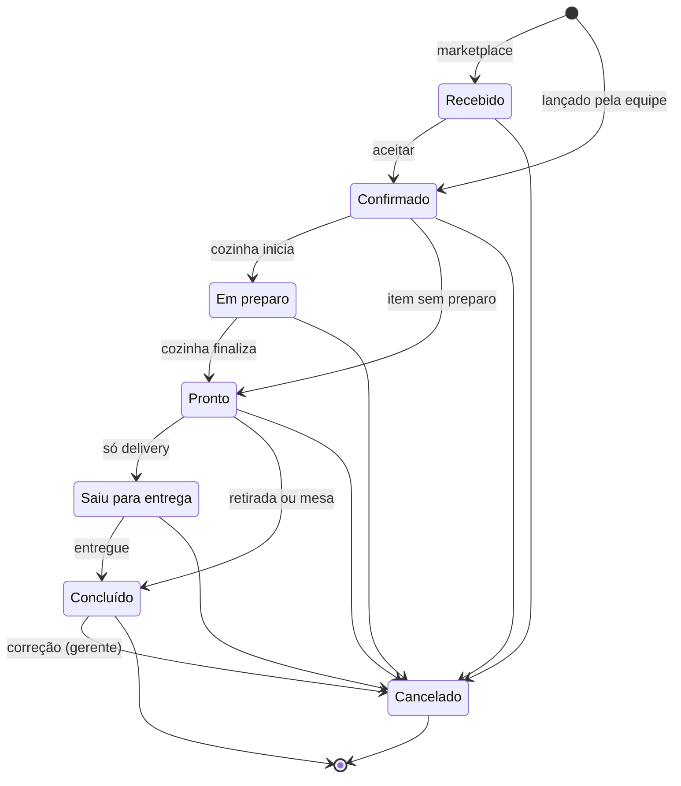
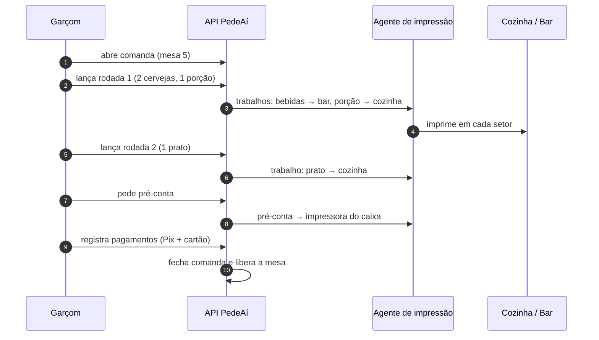
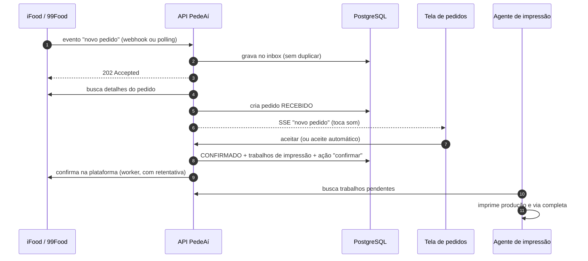

# 01 · Fluxos do restaurante

Antes de falar de tecnologia, precisamos entender como o restaurante trabalha.
Este documento descreve os canais de venda, o ciclo de vida do pedido e o que
acontece quando algo dá errado.

## Canais e tipos de pedido

Todo pedido tem uma **origem** (quem trouxe o pedido) e um **tipo** (como ele é
entregue ao cliente).

| Situação real | Origem (`source`) | Tipo (`type`) |
| --- | --- | --- |
| Cliente pede no balcão e leva | `PEDEAI` | `TAKEOUT` |
| Cliente liga ou manda WhatsApp e pede entrega | `PEDEAI` | `DELIVERY` |
| Cliente liga e busca no local | `PEDEAI` | `TAKEOUT` |
| Garçom lança itens na mesa ou comanda | `PEDEAI` | `DINE_IN` |
| Pedido do iFood | `IFOOD` | `DELIVERY` ou `TAKEOUT` |
| Pedido da 99Food | `NINETY_NINE_FOOD` | `DELIVERY` ou `TAKEOUT` |

**Princípio central:** todo pedido, de qualquer canal, vira um `Pedido` com o
mesmo ciclo de vida. O quadro de pedidos, a tela da cozinha e a impressão
tratam todos da mesma forma. Só o módulo de integração sabe falar com o iFood e
a 99Food.

## Ciclo de vida do pedido

| Status | Significado | Quem move |
| --- | --- | --- |
| **Recebido** | Chegou e aguarda aceite. Vale para marketplace e, no futuro, para o cardápio online. | Integração |
| **Confirmado** | O restaurante aceitou o pedido. Dispara a impressão automática para a produção. | Caixa, aceite automático, ou já nasce assim quando a equipe lança o pedido |
| **Em preparo** | A cozinha começou. | Tela da cozinha (botão "iniciar") ou automático ao confirmar, se a loja não usa tela de cozinha |
| **Pronto** | Tudo pronto. No delivery aguarda o entregador, na retirada aguarda o cliente, na mesa está pronto para servir. | Tela da cozinha ou caixa |
| **Saiu para entrega** | Só para delivery. Pode imprimir a via do entregador. | Caixa/expedição, ou o marketplace quando a entrega é dele |
| **Concluído** | Entregue, retirado ou servido. | Caixa, marketplace, ou em lote no fechamento do caixa |
| **Cancelado** | Motivo obrigatório. Imprime aviso de cancelamento nos setores que já receberam o pedido. | Caixa/gerente, ou o marketplace |

### Regras de transição

- O status **só anda para frente**. Pular etapas é permitido: um pedido só de
  bebidas vai de Confirmado direto para Pronto.
- **Saiu para entrega** só existe para `DELIVERY`.
- **Cancelar** exige motivo em qualquer estado. Depois de *Em preparo*, só
  Gerente ou Dono podem cancelar. Cancelar um pedido *Concluído* é uma correção
  de lançamento: só Gerente ou Dono, só para pedidos próprios, e fica na
  auditoria.
- **Marketplace:** cancelar é um *pedido de cancelamento* enviado à plataforma.
  O status final chega depois, pelo evento da plataforma. Detalhes em
  [05 · Integrações](05-integracoes.md#cancelamento).
- **Idempotência:** aplicar um status que o pedido já tem não faz nada. Isso
  importa porque marketplaces reenviam eventos.
- **Concorrência:** o pedido tem versão (lock otimista). Se duas telas mudarem o
  mesmo pedido ao mesmo tempo, a segunda recebe `409` e recarrega.
- **Histórico:** toda transição grava quem mudou (usuário, sistema, iFood ou
  99Food), quando e o motivo. A linha do tempo do pedido é esse histórico.

### Configurações da loja que mudam o fluxo

| Configuração | Padrão | Efeito |
| --- | --- | --- |
| Pedido lançado pela equipe já nasce confirmado | sim | Pula o "Recebido" nos pedidos próprios |
| Aceite automático de marketplace | não (por integração) | Confirma sozinho ao chegar. Útil em horário de pico. |
| Confirmar já coloca em preparo | não | Para lojas sem tela de cozinha |
| Virada do dia operacional | 05:00 | Um pedido à 01:30 pertence ao dia anterior (numeração e relatórios) |

## Fluxo 1 · Delivery por telefone ou WhatsApp

1. O atendente abre **Novo pedido** e digita o telefone. O cliente e os
   endereços dele aparecem.
2. Escolhe ou cadastra o endereço. A taxa de entrega vem da tabela por bairro,
   ou é digitada.
3. Monta os itens. Ao escolher um produto com adicionais, a tela exige as
   escolhas obrigatórias (mínimo e máximo por grupo).
4. Informa a forma de pagamento e o troco ("troco para R$ 100").
5. Confirma. O pedido nasce **Confirmado**, a produção imprime por setor e a via
   completa sai no caixa, conforme as regras de impressão.
6. A cozinha acompanha na tela ou pelo ticket e marca **Pronto**.
7. O entregador sai: **Saiu para entrega** (pode imprimir a via do entregador).
8. No retorno, **Concluído**. O dinheiro recebido entra no caixa.

## Fluxo 2 · Balcão e retirada

Igual ao delivery, sem endereço. O pagamento é na hora ou na retirada. Quando
fica **Pronto**, o cliente é chamado pelo nome ou pelo número do pedido.

## Fluxo 3 · Salão (mesa e comanda)

No salão a conta fica aberta por horas e recebe itens em várias levas. Por isso
o modelo separa **produção** de **cobrança**:

- A **comanda** (`Tab`) é a conta. Ela pode estar ligada a uma mesa ou ser um
  cartão numerado. A comanda guarda a taxa de serviço, os descontos e os
  pagamentos.
- Cada envio de itens para a cozinha é uma **rodada**. Cada rodada é um `Pedido`
  do tipo `DINE_IN` ligado à comanda. A rodada tem seu próprio status (a cozinha
  prepara e marca pronto) e sai na impressão como um pedido normal.

Funciona assim:

- **Pré-conta:** soma as rodadas não canceladas, aplica a taxa de serviço
  (10% por padrão; o cliente pode recusar) e mostra o valor por pessoa.
- **Fechamento:** aceita vários pagamentos e várias formas. Só fecha quando o
  valor pago cobre o total.
- **Cancelar item já enviado:** exige motivo e imprime "CANCELADO — NÃO
  PREPARAR" no setor daquele item. Depois do início do preparo, exige Gerente.
- **Depois (Etapa 4+):** transferir itens entre mesas, juntar mesas, dividir por
  item.

## Fluxo 4 · iFood e 99Food

- O iFood **cancela sozinho pedidos não confirmados em 8 minutos**. O quadro de
  pedidos destaca pedidos recebidos há mais de 3 minutos, com som repetido, e o
  aceite automático é opcional.
- Daí em diante o pedido segue o fluxo comum. Cada mudança de status relevante é
  enviada de volta à plataforma.
- Se o cliente ou a plataforma cancelar, chega um evento. O pedido vira
  **Cancelado**, aparece um alerta e os setores recebem o aviso de cancelamento.

## Situações de exceção

| Situação | Comportamento esperado |
| --- | --- |
| Impressora sem papel ou desligada | Alerta na tela ("Cozinha sem impressão: 3 pedidos aguardando"). Os trabalhos esperam na fila. Dá para mandar para a impressora reserva. A tela da cozinha continua funcionando. Ver [04 · Impressão](04-impressao.md#impressora-indisponível). |
| Computador do agente desligado | Alerta "impressão parada há 2 min". Ao voltar, imprime o que é recente e lista o que ficou velho demais para sair sozinho. |
| Internet do restaurante cai | O sistema (na nuvem) e os marketplaces param juntos. Mitigação operacional: roteador com 4G de reserva. Modo offline é evolução futura. |
| Cliente do iFood cancela durante o preparo | Evento de cancelamento: status **Cancelado**, alerta sonoro e ticket de cancelamento nos setores. |
| Item do marketplace sem código PDV cadastrado | Entra no setor padrão com o aviso "item não mapeado" no ticket e na tela. |
| Pedido cancelado antes de imprimir | Os trabalhos pendentes são cancelados. Aviso de cancelamento só vai para setores que já imprimiram. |
| Duas pessoas mexendo no mesmo pedido | Lock otimista: a segunda recebe `409` e a tela recarrega. |
| Pedido agendado (iFood) | Aparece em "Agendados" com o horário em destaque. |
| Loja usa também o gestor de pedidos do próprio iFood | Desligar a impressão e o aceite automáticos lá, para não imprimir nem aceitar em dobro. Isso entra no checklist de implantação. |
