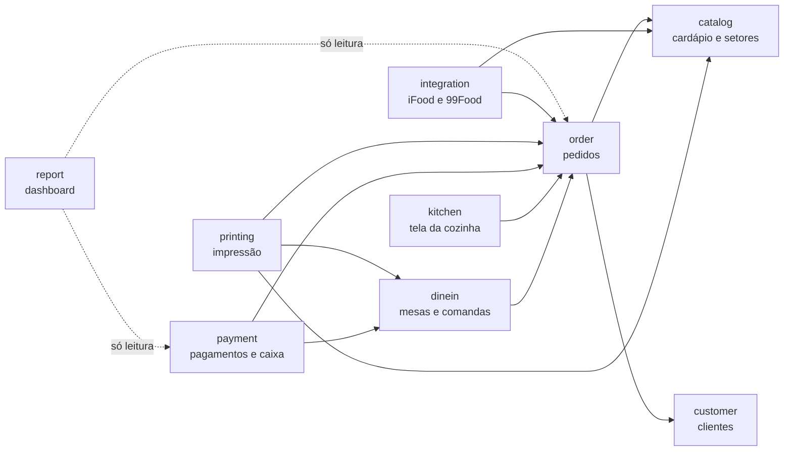
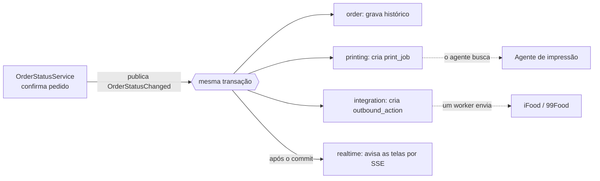

# 02 · Arquitetura

## Containers

| Peça | Onde roda | Responsabilidade |
| --- | --- | --- |
| **SPA** (React + TypeScript) | Navegador do caixa, celular do garçom, TV ou tablet da cozinha, notebook do dono | Telas. Nenhuma regra de negócio que precise ser confiável. |
| **API** (Spring Boot) | Nuvem | Todas as regras: pedidos, status, cobrança, roteamento de impressão, integrações. REST, SSE, webhooks e workers. |
| **PostgreSQL** | Nuvem, gerenciado e sempre ligado | Fonte única da verdade, incluindo as filas (trabalhos de impressão, eventos recebidos, ações a enviar). |
| **Agente de impressão** | Um computador do restaurante | Busca trabalhos no servidor por HTTPS de saída e envia bytes ESC/POS para as impressoras. Ver [04 · Impressão](04-impressao.md). |
| **Marketplaces** | Externos | iFood (Merchant API) e 99Food (Open Delivery). Ver [05 · Integrações](05-integracoes.md). |

### Por que um monolito modular

- **Escala real:** um restaurante movimentado faz de 300 a 800 pedidos por dia.
  Mil lojas dariam cerca de 6 pedidos por segundo em média, com picos de
  dezenas. PostgreSQL com bons índices sobra para isso.
- **Operação:** um deploy, um banco e um log. Numa operação que não pode parar
  na sexta às 20h, cada peça a mais é mais uma coisa para cair.
- **Evolução:** os módulos têm fronteiras explícitas, testadas com ArchUnit. Se
  um dia algum módulo precisar virar serviço separado (por exemplo, as
  integrações), a fronteira já existe.

## Módulos do backend

| Módulo | Responsabilidade | Tabelas principais |
| --- | --- | --- |
| `shared` | Configuração, exceções e handler central, segurança (JWT, contexto da loja), `Money` | — |
| `store` | Loja (tenant), configurações operacionais, usuários, papéis e auditoria | `store`, `app_user`, `refresh_token`, `audit_log` |
| `catalog` | Categorias, produtos, grupos de adicionais, opções e setores de produção | `category`, `product`, `option_group`, `option_item`, `product_option_group`, `sector` |
| `customer` | Clientes, endereços e taxa de entrega por bairro | `customer`, `customer_address`, `delivery_zone` |
| `order` | Pedido, itens, máquina de estados, numeração diária, histórico | `orders`, `order_item`, `order_item_option`, `order_status_history`, `order_number_counter` |
| `dinein` | Mesas e comandas (salão) | `dining_table`, `tab` |
| `kitchen` | Tela da cozinha: consultas e ações delegadas ao `order` | — |
| `printing` | Impressoras, agentes, roteamento por setor, regras, fila, renderização ESC/POS e HTML | `printer`, `print_agent`, `agent_pairing_code`, `sector_printer`, `print_rule`, `print_job` |
| `payment` | Formas de pagamento, pagamentos, caixa (abertura, fechamento, sangria, suprimento) | `payment_method`, `payment`, `cash_session`, `cash_movement`, `cash_session_count` |
| `report` | Dashboard e faturamento. Só leitura, SQL direto. | — |
| `integration` | Núcleo de marketplace (inbox, outbox, vínculo de loja) e adaptadores `ifood` e `opendelivery` | `marketplace_connection`, `inbound_event`, `outbound_action` |
| `realtime` | SSE para telas e agentes | — |

### Dependências entre módulos



Todos dependem de `store` e `shared`; o diagrama omite essas setas.

Regras, verificadas por testes ArchUnit:

1. Um módulo usa outro **só pelos serviços e DTOs públicos** dele. Nunca pelo
   repository nem pelas entidades de outro módulo.
2. **`order` não conhece ninguém que reage a ele.** Impressão, integração,
   tempo real e (no futuro) estoque e fiscal escutam eventos do pedido. É isso
   que permite adicionar módulos sem mexer no núcleo.
3. **Sem ciclos.** Se dois módulos precisam um do outro, um deles passa a
   escutar eventos.

## Estrutura de pacotes

Pacote por módulo e, dentro dele, as camadas da convenção:

```
com.pedeai
├── PedeAiApplication.java
├── shared
│   ├── config        Clock, Jackson, OpenAPI, agendamento
│   ├── exception     ApiError, GlobalExceptionHandler, ResourceNotFoundException,
│   │                 BusinessRuleException, ConflictException
│   ├── security      SecurityConfig, JwtService, CurrentUser, StoreContext
│   └── money         Money
├── order
│   ├── controller    OrderController, OrderStatusController
│   ├── service       OrderService, OrderStatusService, OrderNumberService, OrderPricing
│   ├── repository    OrderRepository, OrderStatusHistoryRepository
│   ├── dto           CreateOrderRequest, OrderResponse, ChangeOrderStatusRequest …
│   ├── domain        Order, OrderItem, OrderItemOption, OrderStatus, OrderType, OrderSource
│   └── event         OrderCreated, OrderStatusChanged, OrderItemsCancelled
├── catalog  …        (mesma estrutura)
├── printing
│   ├── controller  service  repository  dto  domain  event
│   ├── rendering     TicketResponse, TicketLayout (um layout por documento), EscPosRenderer
│   └── agent         API usada pelo agente (autenticada por token de dispositivo)
└── integration
    ├── controller  service  repository  dto  domain
    ├── ifood         IfoodConnector, IfoodAuthClient, IfoodOrderMapper, IfoodWebhookController
    └── opendelivery  OpenDeliveryConnector, OpenDeliveryOrderMapper, OpenDeliveryWebhookController
```

Regras fixas da convenção:

- Controller recebe e valida a entrada (`@Valid`). Não tem regra de negócio e
  **nunca acessa repository**.
- Service tem a regra e `@Transactional` nos métodos de escrita.
- **Entidade JPA nunca sai na API.** Sempre mapeia para DTO (`record`).
- Um único `@RestControllerAdvice`. Corpo de erro padronizado com `timestamp`,
  `status`, `message` e `path`. Stack trace nunca vaza.

## Comunicação entre módulos e efeitos colaterais

Este é o ponto mais importante da arquitetura. Confirmar um pedido precisa,
**com garantia**, gerar a impressão na cozinha e avisar o iFood. Se o servidor
cair entre uma coisa e outra, nada pode se perder.



1. O serviço altera o pedido e publica um **evento de domínio** com o
   `ApplicationEventPublisher` do Spring.
2. **Listeners na mesma transação** (`@EventListener` síncrono) só **gravam
   linhas** de trabalho: `print_job`, `outbound_action`, histórico. Se o pedido
   foi gravado, o trabalho também foi. Se houve rollback, nenhum dos dois
   existe. Esses listeners **nunca chamam a rede** e **não lançam exceção por
   configuração**: impressora não configurada vira alerta, não desfaz a
   confirmação do pedido.
3. **Listeners após o commit** (`@TransactionalEventListener(AFTER_COMMIT)`)
   fazem o que pode se perder sem dano: o aviso SSE para as telas.
4. **Workers** agendados processam as tabelas de trabalho. O agente de impressão
   também consome a sua. Para reservar um item de trabalho usamos `UPDATE`
   condicional (`… WHERE id = ? AND status = 'PENDING'`). É portável (roda em
   H2 e PostgreSQL) e seguro com mais de uma instância. Jobs que precisam
   rodar em uma instância só, como o polling do iFood, usam ShedLock quando
   houver mais de uma instância.

Na prática, cada tabela de trabalho funciona como um *outbox*: o efeito
colateral vira uma linha gravada junto com a mudança de negócio. Não
precisamos de broker nem de biblioteca de mensageria.

## Tempo real (SSE)

- As telas (quadro de pedidos, cozinha, salão, painel de impressão) abrem
  `GET /api/stream`. O agente abre `GET /api/agent/stream`.
- **O evento é só um aviso**, por exemplo
  `{ "type": "order.status_changed", "orderId": "…", "version": 7 }`. A tela
  invalida a query do TanStack Query e recarrega pelo REST. Se o SSE cair e
  voltar, basta recarregar. Não precisamos de replay nem de ordem garantida.
- O agente de impressão também consulta a fila a cada 30 segundos, com ou sem
  aviso SSE. O aviso deixa a impressão imediata, e a consulta garante que nada
  fica parado.
- Um comentário de keepalive a cada 25 segundos evita que proxies fechem a
  conexão.
- O `EventSource` nativo não envia `Authorization`. Por isso o frontend lê o
  stream com `fetch` (`shared/api/stream.ts`, sem biblioteca), com o token de
  acesso e a renovação automática da sessão. Se a conexão cai, reconecta
  sozinho, esperando mais a cada falha (até 30 s), e ao voltar recarrega as
  listas, porque pode ter perdido avisos. É uma conexão por aba.
- **Mais de uma instância da API:** a interface `RealtimeBroadcaster` começa com
  uma implementação em memória. Quando houver duas ou mais instâncias, ganha uma
  implementação com `LISTEN/NOTIFY` do PostgreSQL. Sem Redis.

## Multi-loja e segurança

### Isolamento entre lojas

- **Tenant = loja (`store`).** Toda tabela de negócio tem `store_id`, inclusive
  as tabelas filhas, como `order_item`. Assim nenhuma consulta depende de join
  para filtrar.
- O `store_id` vem **sempre do usuário autenticado**, nunca da URL nem do corpo
  da requisição.
- Repositórios buscam por `id` **e** loja: `findByIdAndStoreId(id, storeId)`. Um
  id de outra loja responde `404`, como no Denguinho.
- Todo controller tem um teste de IDOR: usuário da loja A pede um recurso da
  loja B e recebe 404.

### Autenticação

- Login com e-mail e senha (BCrypt). Devolve um **JWT de acesso curto**
  (15 min) e um **refresh token rotativo** (30 dias). O refresh token é salvo
  como hash no banco e pode ser revogado por dispositivo. Isso importa para a
  TV da cozinha, que fica logada por semanas.
- **Agente de impressão:** token de dispositivo obtido por pareamento (código de
  6 dígitos gerado na tela de configurações, válido por 10 minutos). O token só
  acessa `/api/agent/**` e pode ser revogado.
- **Webhooks de marketplace:** sem JWT. Cada requisição é validada pela
  assinatura HMAC-SHA256 do corpo cru, com comparação em tempo constante.

### Papéis

| Ação | Dono | Gerente | Caixa | Garçom | Cozinha |
| --- | :-: | :-: | :-: | :-: | :-: |
| Lançar pedidos e rodadas | ✓ | ✓ | ✓ | ✓ salão | |
| Avançar status (preparo, pronto) | ✓ | ✓ | ✓ | | ✓ |
| Aceitar pedido de marketplace | ✓ | ✓ | ✓ | | |
| Receber pagamento, fechar comanda | ✓ | ✓ | ✓ | | |
| Cancelar antes do preparo | ✓ | ✓ | ✓ | | |
| Cancelar depois do preparo, dar desconto | ✓ | ✓ | | | |
| Reimprimir | ✓ | ✓ | ✓ | ✓ | ✓ produção |
| Abrir e fechar caixa, sangria, suprimento | ✓ | ✓ | ✓ | | |
| Cardápio, impressoras, integrações | ✓ | ✓ | | | |
| Usuários e dados da loja | ✓ | | | | |
| Relatórios financeiros | ✓ | ✓ | | | |

Depois do MVP: "senha do gerente" para autorizar na hora uma ação sensível no
terminal do caixa.

### Dados sensíveis e auditoria

- Credenciais em variáveis de ambiente, nunca no código. `.gitignore` cobre
  `.env` e `application-local.properties`.
- Credenciais de marketplace por loja (Open Delivery) ficam cifradas no banco
  (AES-GCM, chave vinda de variável de ambiente).
- `audit_log` para ações sensíveis: cancelamento, desconto, reimpressão, sangria
  e mudança de configuração de impressão.
- **LGPD:** guardamos só o necessário. Dados de clientes vindos de marketplace
  ficam apenas no snapshot do pedido. Eles não entram na base de clientes da
  loja e não servem para marketing. Retenção e anonimização vêm antes do
  lançamento comercial.

## API REST

Convenções:

- Prefixo `/api`, substantivos no plural, sem verbos na rota.
- Mudança de estado é um recurso: `PATCH /api/orders/{id}/status` com
  `{ "status": "READY" }`. Reimpressão cria um recurso:
  `POST /api/orders/{id}/print-jobs`.
- `POST` de criação devolve `201` e o header `Location`. Códigos de erro: `400`
  validação, `404` não encontrado (inclusive de outra loja), `409` conflito de
  versão ou duplicidade.
- Listas que crescem sem limite são paginadas (`Pageable`), como o histórico de
  pedidos, os clientes e a fila de impressão.
- Dinheiro trafega em centavos (`totalCents: 4590`). O frontend só formata.
- OpenAPI via springdoc. Os tipos TypeScript do frontend são gerados a partir
  dele.

| Recurso | Rotas principais |
| --- | --- |
| Autenticação | `POST /api/auth/login`, `POST /api/auth/refresh`, `POST /api/auth/logout` |
| Loja e usuários | `GET/PATCH /api/store`, `GET/POST /api/users`, `PATCH /api/users/{id}` |
| Cardápio | `/api/sectors`, `/api/categories`, `/api/products`, `/api/option-groups`, `/api/option-groups/{id}/options`, `PUT /api/products/{id}/availability` |
| Clientes | `GET /api/customers?phone=`, `POST /api/customers`, `/api/customers/{id}/addresses`, `/api/delivery-zones` |
| Pedidos | `GET /api/orders` (filtros e paginação), `POST /api/orders`, `GET /api/orders/{id}`, `PATCH /api/orders/{id}/status`, `PATCH /api/orders/{id}/items/{itemId}` (cancelar item), `GET /api/orders/{id}/history`, `POST /api/orders/{id}/payments`, `POST /api/orders/{id}/print-jobs` |
| Cozinha | `GET /api/kitchen/orders?sectorId=` |
| Salão | `/api/tables`, `GET/POST /api/tabs`, `POST /api/tabs/{id}/orders` (nova rodada), `POST /api/tabs/{id}/payments`, `POST /api/tabs/{id}/print-jobs` (pré-conta), `PATCH /api/tabs/{id}/status` |
| Pagamentos e caixa | `/api/payment-methods`, `GET /api/cash-sessions/current`, `POST /api/cash-sessions`, `PATCH /api/cash-sessions/{id}`, `POST /api/cash-sessions/{id}/movements` |
| Impressão (gestão) | `/api/printers`, `POST /api/printers/{id}/print-jobs` (teste), `PUT /api/sectors/{id}/printer`, `/api/print-rules`, `GET /api/print-jobs?status=`, `PATCH /api/print-jobs/{id}`, `/api/print-agents`, `POST /api/print-agents/pairing-codes` |
| Agente (token de dispositivo) | `POST /api/agent/pairings`, `GET /api/agent/stream`, `GET /api/agent/config`, `GET /api/agent/jobs?status=PENDING`, `PATCH /api/agent/jobs/{id}`, `PUT /api/agent/status`, `PUT /api/agent/discovered-printers` |
| Integrações | `GET/POST /api/integrations`, `PATCH /api/integrations/{id}`, `GET /api/integrations/{id}/events` |
| Webhooks (públicos, assinados) | `POST /api/webhooks/ifood`, `POST /api/webhooks/opendelivery/{provider}` |
| Relatórios | `GET /api/reports/dashboard?date=`, `GET /api/reports/revenue?from=&to=&groupBy=` |
| Tempo real | `GET /api/stream` |

## Frontend

```
frontend/src/
├── app/            rotas, providers, layout, guarda de autenticação
├── shared/
│   ├── api/        cliente HTTP (refresh de token), tipos gerados do OpenAPI, cliente SSE
│   ├── ui/         componentes base
│   └── lib/        dinheiro, datas, telefone
└── features/
    ├── auth/  orders/  dine-in/  kitchen/  catalog/  customers/
    └── payments/  printing/  integrations/  reports/  settings/
```

Pilha: React, TypeScript, Vite, React Router, **TanStack Query** (estado do
servidor, invalidado pelo SSE), **React Hook Form + Zod** (formulários) e
**Mantine** (componentes prontos para tabela, formulário, modal, notificação e
gráfico, com menos montagem do que juntar peças avulsas).

| Tela | Pontos-chave |
| --- | --- |
| **Quadro de pedidos** | Colunas por status. Selo de origem (iFood, 99Food, balcão, mesa). Tempo decorrido. Som em pedido novo. Alerta de pedido recebido há mais de 3 min. |
| **Novo pedido (PDV)** | Busca por nome ou código, grade por categoria, modal de adicionais que valida mínimo e máximo, cliente pelo telefone, troco. Pensado para teclado e para toque. |
| **Detalhe do pedido** | Itens, totais, pagamentos, linha do tempo, ações, reimpressão e situação da sincronização com o marketplace. |
| **Salão** | Mesas livres, ocupadas e pedindo conta. Comanda com rodadas, pré-conta, pagamentos e fechamento. Funciona no celular do garçom. |
| **Cozinha (KDS)** | Tela cheia, cartões grandes, filtro por setor, cronômetro com cores, "iniciar", "pronto" e "desfazer". *Wake Lock* para a tela não apagar. |
| **Impressões** | Fila com pendentes, falhas, incertos e expirados. Status das impressoras e dos agentes. Ações de reenviar e redirecionar. |
| **Gestão** | Cardápio, clientes, caixa, dashboard, histórico e configurações (loja, usuários, pagamentos, taxas, impressão, integrações). |

O navegador só toca som depois de um clique do usuário. Por isso o quadro de
pedidos e a cozinha abrem com "Toque para ativar os alertas".

## Testes

Segue a convenção (toda feature nova vem com teste). A prioridade é: regra com
dinheiro ou dado de cliente, depois o fluxo principal, depois casos de borda.

| Nível | O quê | Ferramentas |
| --- | --- | --- |
| Unitário de domínio e serviço | Máquina de estados, cálculo de preço com adicionais (soma, maior valor, média), taxa de serviço, roteamento de impressão, idempotência | JUnit 5 + Mockito |
| Controller | Status HTTP, formato do JSON, validação, IDOR | `@WebMvcTest` |
| Integração | Migrações Flyway, repositórios, fluxo pedido → trabalhos de impressão | `@SpringBootTest` + H2 (modo PostgreSQL) |
| Contrato com marketplace | Token, polling, webhook assinado, 401/429/5xx, payloads de exemplo da documentação oficial | WireMock + fixtures JSON |
| Impressão | Bytes ESC/POS comparados com arquivos esperados (*golden files*), agente contra impressora falsa (servidor TCP) | JUnit |
| Arquitetura | Controller não acessa repository, módulos só via API pública, sem ciclos | ArchUnit |
| Frontend | Componentes e fluxos com API simulada | Vitest + Testing Library + MSW |
| Ponta a ponta | Criar pedido → aparece na cozinha → pronto → concluído | Playwright |

**H2 e PostgreSQL:** a convenção usa H2 nos testes. Por isso as migrações ficam
em SQL portável: JSON cru em `TEXT` (não `JSONB`), sem índice parcial e sem
`ON CONFLICT` (a duplicidade é barrada por constraint `UNIQUE` e tratada no
código). Para pegar diferenças que o H2 esconde, o CI também sobe a aplicação
contra um PostgreSQL real (service container do GitHub Actions) e roda as
migrações e um smoke test.

## Deploy e operação

- **Local:** `compose.yaml` com PostgreSQL. Backend com o perfil `local`.
  Frontend no Vite com proxy para a API. O agente pode imprimir num arquivo
  (impressora falsa) ou numa impressora de rede real.
- **CI (GitHub Actions):** `mvn verify` no backend; lint, typecheck, testes e
  build no frontend; build do agente; smoke test contra PostgreSQL real.
- **Produção:** um container da API, PostgreSQL gerenciado **sempre ligado**
  (plano gratuito que pausa por inatividade não serve para restaurante), SPA
  estática em CDN, domínio próprio com HTTPS (os webhooks precisam de URL
  pública). O frontend e a API ficam no mesmo site (`app.` e `api.` do mesmo
  domínio).
- **Observabilidade:** Actuator (health), logs estruturados, métricas Micrometer
  (pedidos por minuto, atraso da fila de impressão, eventos de marketplace
  pendentes), rastreio de erros (Sentry) e monitor de disponibilidade no
  endpoint de webhook.
- **Backups:** backup diário e restauração a um ponto no tempo (PITR) no banco
  gerenciado.
- **Tempo:** servidor em UTC. Cada loja tem seu fuso (`America/Sao_Paulo` por
  padrão) e sua virada do dia operacional. Um `Clock` injetado permite testar a
  virada do dia, como no Denguinho.
- **Escalar:** duas instâncias ou mais pedem ShedLock nos jobs agendados e
  `LISTEN/NOTIFY` no tempo real. Relatórios pesados podem ir para uma réplica
  de leitura.

## Evolução: onde os módulos futuros se encaixam

| Módulo futuro | Como entra sem mexer no núcleo |
| --- | --- |
| **Estoque** | Escuta `OrderStatusChanged` (confirmado ou cancelado) e baixa ou devolve insumos pela ficha técnica. |
| **Fiscal (NFC-e)** | Escuta pedido concluído e comanda fechada, emite por um provedor e imprime o DANFE NFC-e pela mesma fila de impressão. |
| **Financeiro completo** | Lê pagamentos e caixas. Contas a pagar e a receber. Repasses do marketplace pela API financeira do iFood. |
| **Delivery próprio** | Entregadores, despacho e acerto usando as transições "saiu para entrega" e "concluído". |
| **Cardápio digital / pedido online** | Nova origem (`ONLINE`) que cria pedidos pelo mesmo `OrderService`, entrando como "Recebido". |
| **Outras plataformas Open Delivery** (ex.: Keeta) | Nova configuração do adaptador `opendelivery`. |
| **Periféricos locais** | O agente vira ponte para gaveta de dinheiro, balança e TEF. |
| **Relatórios avançados, multi-loja (redes), fidelidade, avisos por WhatsApp** | Leitura dos dados existentes ou escuta de eventos de status. |

## Glossário

| Português (interface) | Código | Observação |
| --- | --- | --- |
| Loja / restaurante | `Store` | Tenant |
| Pedido | `Order` | Tabela `orders` (`order` é palavra reservada no SQL) |
| Rodada | `Order` do tipo `DINE_IN` com `tabId` | Cada envio de itens da mesa |
| Comanda / conta da mesa | `Tab` | |
| Mesa | `DiningTable` | |
| Setor de produção (cozinha, bar) | `Sector` | |
| Grupo de adicionais / complementos | `OptionGroup` | Mínimo, máximo e regra de preço |
| Adicional / opção | `OptionItem` | Tabela `option_item` (`option` é palavra reservada no SQL) |
| Código PDV | `code` | Liga o item do marketplace ao produto |
| Pré-conta | `PRE_BILL` | Documento impresso |
| Via completa | `ORDER_TICKET` | Documento impresso |
| Ticket de produção | `PRODUCTION_TICKET` | Documento impresso |
| Caixa (sessão) | `CashSession` | |
| Sangria / suprimento | `CashMovement` `WITHDRAWAL` / `DEPOSIT` | |
| Troco para | `changeForCents` | |
| Taxa de serviço | `serviceFee` | Percentual em pontos-base: `1000` = 10% |
