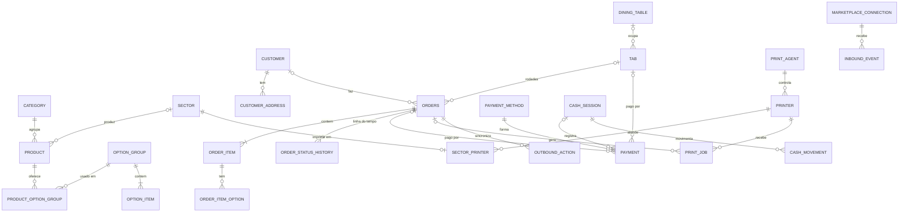

# 03 · Modelo de dados

Proposta do esquema inicial. Os nomes são de código (inglês). O
[glossário](02-arquitetura.md#glossário) traduz. Cada etapa do roadmap cria só
as tabelas que usa, com migrações Flyway.

## Convenções

| Tema | Regra |
| --- | --- |
| Chave primária | `id UUID`, gerado pela aplicação (UUID v7, ordenado no tempo, bom para índice). Funciona igual em H2 e PostgreSQL. |
| Loja | `store_id UUID NOT NULL` em **toda** tabela de negócio, inclusive nas filhas. Índices compostos começam por `store_id`. |
| Dinheiro | `*_cents BIGINT`. No Java, o value object `Money` guarda `long` e arredonda explicitamente (percentuais com `HALF_UP`). |
| Percentual | Pontos-base em `INTEGER`: `1000` = 10,00%. |
| Datas | `TIMESTAMP WITH TIME ZONE`, sempre em UTC. O dia operacional é `business_date DATE`, calculado com o fuso e a virada do dia da loja. |
| Concorrência | `version BIGINT` (lock otimista) nos agregados que mais de uma tela altera: `orders`, `tab`, `cash_session`. |
| Snapshot | O pedido copia nome, código, preço e setor de cada item. Mudar o cardápio nunca altera um pedido antigo. |
| Exclusão | Cadastros usados em pedidos nunca são apagados. São desativados (`active = false`). |
| Enums | `VARCHAR` com `CHECK` da lista de valores. |
| Portabilidade | SQL que roda em H2 (modo PostgreSQL) e em PostgreSQL. JSON cru em `TEXT`, sem índice parcial, sem `ON CONFLICT`. |

## Visão geral

## Loja e acesso (`store`)

| Tabela | Colunas principais | Regras |
| --- | --- | --- |
| `store` | `name`, `document` (CNPJ/CPF), `phone`, `timezone`, `business_day_cutoff` (TIME, padrão 05:00), `service_fee_bp` (padrão 1000), `auto_confirm_own_orders`, `start_preparation_on_confirm` | É o tenant. Configurações operacionais simples ficam como colunas; uma tabela de configurações só se crescer muito. |
| `app_user` | `store_id`, `name`, `email`, `password_hash`, `role` (`OWNER`, `MANAGER`, `CASHIER`, `WAITER`, `KITCHEN`), `active` | `email` único. `user` é palavra reservada, por isso `app_user`. Multi-loja por usuário fica para o futuro. |
| `refresh_token` | `user_id`, `token_hash`, `device_name`, `expires_at`, `revoked_at` | Rotação a cada uso. Revogável por dispositivo. |
| `audit_log` | `store_id`, `user_id`, `action`, `entity_type`, `entity_id`, `details` (TEXT), `created_at` | Ações sensíveis. Só inserção. |

## Cardápio (`catalog`)

| Tabela | Colunas principais | Regras |
| --- | --- | --- |
| `sector` | `store_id`, `name` (Cozinha, Bar, Pizzaria), `is_default`, `sort_order`, `active` | Setor de produção. Um setor ativo é o padrão da loja (`is_default`): o primeiro criado já nasce padrão, e o padrão só muda quando outro é marcado no lugar (ver [D18](decisoes.md#d18--setor-padrão-marcado-no-próprio-setor)). A impressora de cada setor fica no módulo de impressão. |
| `category` | `store_id`, `name`, `sort_order`, `default_sector_id`, `active` | O setor da categoria vale para os produtos que não definem o seu. |
| `product` | `store_id`, `category_id`, `code` (código PDV), `name`, `description`, `price_cents`, `sector_id`, `active`, `available`, `sort_order` | `UNIQUE(store_id, code)`. `available = false` pausa o item sem desativar. O setor segue a ordem produto → categoria → padrão da loja. |
| `option_group` | `store_id`, `name` ("Adicionais", "Ponto da carne", "Sabores"), `min_choices`, `max_choices`, `pricing_rule` (`SUM`, `MAX`, `AVERAGE`), `active` | `SUM` é o padrão. `MAX` e `AVERAGE` resolvem pizza meio a meio (vale o sabor mais caro, ou a média, arredondada com `HALF_UP`). Em `MAX` e `AVERAGE` cada opção entra uma vez só. |
| `option_item` | `store_id`, `option_group_id`, `code`, `name`, `price_cents`, `active`, `available`, `sort_order` | `option` é palavra reservada, por isso `option_item`. `UNIQUE(option_group_id, code)`. Opção removida do grupo fica inativa (pedidos antigos apontam para ela). Cadastrar de novo uma opção com o mesmo código PDV traz a antiga de volta. |
| `product_option_group` | `product_id`, `option_group_id`, `sort_order` | PK `(product_id, sort_order)`: a posição é a ordem em que o grupo aparece no produto. Um grupo pode ser reutilizado em vários produtos. Exceção à regra do `store_id`: é uma coleção do produto (só é lida junto com ele), não uma entidade. |

## Clientes (`customer`)

| Tabela | Colunas principais | Regras |
| --- | --- | --- |
| `customer` | `store_id`, `name`, `phone` (E.164), `email`, `notes` | `UNIQUE(store_id, phone)`. Só clientes dos canais próprios. |
| `customer_address` | `store_id`, `customer_id`, `label`, `street`, `number`, `complement`, `neighborhood`, `city`, `state`, `postal_code`, `reference`, `active` | O pedido reaproveita o endereço igual já salvo em vez de duplicar. Remover só desativa: o endereço some da lista, e cada pedido guarda a própria cópia. Latitude e longitude entram com o delivery próprio. |
| `delivery_zone` | `store_id`, `neighborhood`, `neighborhood_key`, `fee_cents`, `active` | Taxa por bairro, o modelo mais comum em restaurante pequeno. `neighborhood_key` é o nome sem acento e em minúsculas, com `UNIQUE(store_id, neighborhood_key)`: "Centro" e "centro" são o mesmo bairro. Taxa por distância fica para o delivery próprio. |

## Pedidos (`order`)

| Tabela | Colunas principais | Regras |
| --- | --- | --- |
| `orders` | `store_id`, `business_date`, `number`, `type`, `source`, `status`, `tab_id` (Etapa 4), `customer_id`, `customer_name`, `customer_phone`, endereço de entrega (colunas `delivery_*`), `notes`, `subtotal_cents`, `discount_cents`, `platform_subsidy_cents`, `delivery_fee_cents`, `additional_fee_cents`, `total_cents`, `external_id`, `external_display_id`, `scheduled_for`, `confirmed_at`, `preparation_started_at`, `ready_at`, `dispatched_at`, `completed_at`, `cancelled_at`, `cancel_reason`, `created_by`, `version` | `UNIQUE(store_id, business_date, number)`. `UNIQUE(store_id, source, external_id)` impede importar o mesmo pedido de marketplace duas vezes; pedidos próprios têm `external_id` nulo, e nulos não colidem. Índices: `(store_id, status)`, `(store_id, business_date)`. |
| `order_item` | `store_id`, `order_id`, `product_id`, `code`, `name`, `sector_id`, `quantity`, `unit_price_cents`, `options_price_cents`, `total_cents`, `notes`, `status` (`ACTIVE`, `CANCELLED`), `cancel_reason`, `sort_order` | Snapshot. `product_id` pode ser nulo (item de marketplace sem código PDV conhecido). |
| `order_item_option` | `store_id`, `order_item_id`, `option_item_id`, `group_name`, `name`, `code`, `quantity`, `unit_price_cents`, `sort_order` | Snapshot do preço de cada opção no cardápio. Não tem total: o valor cobrado pelas opções fica em `order_item.options_price_cents`, porque em "maior valor" e "média" ele não é a soma das opções. |
| `order_status_history` | `store_id`, `order_id`, `from_status`, `to_status`, `actor_type` (`USER`, `SYSTEM`, `MARKETPLACE`), `actor_id`, `actor_name`, `reason`, `created_at` | A linha do tempo do pedido. Só inserção. |
| `order_number_counter` | `store_id`, `business_date`, `last_number` | PK `(store_id, business_date)`. Incremento com lock pessimista na linha. Numeração curta ("Pedido 42") que recomeça a cada dia operacional. |

Sobre os descontos: `discount_cents` é o desconto que **a loja** paga.
`platform_subsidy_cents` é o que o **marketplace** paga (cupom do iFood, por
exemplo). A diferença importa para o faturamento: num cupom do iFood de R$ 10
num pedido de R$ 50, a loja vendeu R$ 50.

## Salão (`dinein`)

| Tabela | Colunas principais | Regras |
| --- | --- | --- |
| `dining_table` | `store_id`, `name`, `area`, `seats`, `sort_order`, `active` | Livre ou ocupada é derivado da comanda aberta. |
| `tab` | `store_id`, `number`, `dining_table_id`, `status` (`OPEN`, `CLOSED`, `CANCELLED`), `customer_name`, `people_count`, `service_fee_enabled`, `service_fee_bp`, `discount_cents`, `opened_by`, `opened_at`, `closed_by`, `closed_at`, `version` | No máximo uma comanda aberta por mesa. A regra fica no serviço, com lock na mesa, porque índice parcial não é portável. Os totais são calculados a partir das rodadas. |

## Pagamentos e caixa (`payment`)

| Tabela | Colunas principais | Regras |
| --- | --- | --- |
| `payment_method` | `store_id`, `name`, `type` (`CASH`, `PIX`, `CREDIT`, `DEBIT`, `VOUCHER`, `ONLINE`, `OTHER`), `active`, `sort_order` | Criadas com a loja: Dinheiro, Pix, Crédito, Débito, Vale-refeição, Online iFood e Online 99Food. |
| `payment` | `store_id`, `order_id` **ou** `tab_id`, `payment_method_id`, `amount_cents`, `change_for_cents`, `status` (`PENDING`, `PAID`, `CANCELLED`), `origin` (`LOCAL`, `MARKETPLACE`), `cash_session_id`, `paid_at`, `received_by` | `CHECK` de que exatamente um entre `order_id` e `tab_id` está preenchido. Delivery e retirada são pagos no pedido; salão é pago na comanda. Pagamento na entrega fica `PENDING` até o acerto. `CHECK(change_for_cents >= amount_cents)`: o troco é "para" um valor maior que o pago. Hoje (Etapa 2) só existe `order_id`, obrigatório; `tab_id` e `cash_session_id` entram com o salão e o caixa. |
| `cash_session` | `store_id`, `status` (`OPEN`, `CLOSED`), `opened_by`, `opened_at`, `opening_amount_cents`, `closed_by`, `closed_at`, `notes`, `version` | Uma sessão aberta por loja no MVP (um caixa). |
| `cash_movement` | `store_id`, `cash_session_id`, `type` (`WITHDRAWAL` = sangria, `DEPOSIT` = suprimento), `amount_cents`, `reason`, `created_by`, `created_at` | |
| `cash_session_count` | `cash_session_id`, `payment_method_id`, `expected_cents`, `counted_cents` | Conferência no fechamento, com a diferença por forma de pagamento. |

## Impressão (`printing`)

| Tabela | Colunas principais | Regras |
| --- | --- | --- |
| `print_agent` | `store_id`, `name`, `token_hash`, `os`, `version`, `last_seen_at`, `revoked_at` | Online ou offline é derivado de `last_seen_at`. |
| `agent_pairing_code` | `store_id`, `code_hash`, `expires_at`, `used_at` | 6 dígitos, 10 minutos, uso único. |
| `printer` | `store_id`, `agent_id`, `name`, `connection_type` (`NETWORK`, `SYSTEM`), `host`, `port`, `system_name`, `paper_width_mm`, `columns`, `codepage`, `cut_mode`, `beep`, `active`, `status`, `status_detail`, `status_updated_at` | Cada impressora pertence a um agente. |
| `sector_printer` | `sector_id` (PK), `store_id`, `printer_id`, `backup_printer_id`, `copies`, `enabled` | Para qual impressora vai a produção de cada setor. |
| `print_rule` | `store_id`, `document_type`, `trigger`, `order_type`, `order_source`, `printer_id`, `copies`, `active` | Filtros nulos valem para qualquer valor. Ver [04 · Impressão](04-impressao.md#regras-de-impressão). |
| `print_job` | `store_id`, `printer_id`, `agent_id`, `document_type`, `order_id`, `tab_id`, `reason` (`AUTO`, `MANUAL`, `REPRINT`, `TEST`), `idempotency_key`, `delivery_key`, `status`, `attempts`, `next_attempt_at`, `lease_until`, `last_error`, `payload` (bytes ESC/POS), `preview` (texto), `requested_by`, `created_at`, `sent_at`, `printed_at` | `UNIQUE(store_id, idempotency_key)` barra duplicidade na origem. Índice `(agent_id, status)`. Limpeza periódica de trabalhos antigos. |

## Integrações (`integration`)

| Tabela | Colunas principais | Regras |
| --- | --- | --- |
| `marketplace_connection` | `store_id`, `provider` (`IFOOD`, `NINETY_NINE_FOOD`), `external_merchant_id`, `status` (`ACTIVE`, `PAUSED`, `ERROR`), `auto_confirm`, `credentials_encrypted`, `last_event_at`, `last_error` | `UNIQUE(provider, external_merchant_id)`: um merchant do iFood só pode estar ligado a uma loja. |
| `inbound_event` | `provider`, `external_event_id`, `external_merchant_id`, `external_order_id`, `event_code`, `payload` (TEXT), `store_id`, `status` (`PENDING`, `PROCESSED`, `IGNORED`, `FAILED`), `attempts`, `next_attempt_at`, `last_error`, `received_at`, `processed_at` | `UNIQUE(provider, external_event_id)`: o mesmo evento chegando duas vezes (webhook e polling, ou reenvio) é gravado uma vez. `store_id` fica nulo até achar o vínculo. |
| `outbound_action` | `store_id`, `provider`, `order_id`, `action` (`CONFIRM`, `START_PREPARATION`, `READY`, `DISPATCH`, `REQUEST_CANCELLATION`), `payload` (TEXT), `status` (`PENDING`, `DONE`, `FAILED`, `SKIPPED`), `attempts`, `next_attempt_at`, `last_error`, `created_at`, `done_at` | As ações de um mesmo pedido saem em ordem. |

## O que fica de fora agora (e como entra depois)

- **Venda por peso (kg):** hoje `quantity` é inteiro. Vira `NUMERIC(10,3)`, com
  unidade no produto, quando houver restaurante por quilo.
- **Produção por setor na tela da cozinha:** hoje o status é do pedido inteiro.
  Se cozinha e bar precisarem marcar "pronto" separadamente, entra uma tabela
  `production_ticket (order_id, sector_id, status)`. O setor já está gravado em
  cada item, então a mudança só adiciona.
- **Fiscal, estoque, financeiro:** tabelas próprias em módulos novos. Elas
  referenciam `orders.id` e `tab.id` e nunca alteram essas tabelas.
