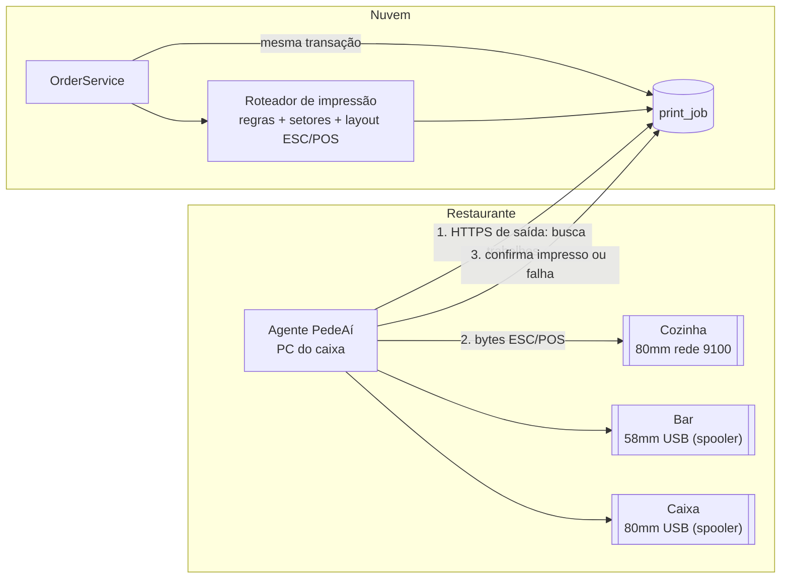
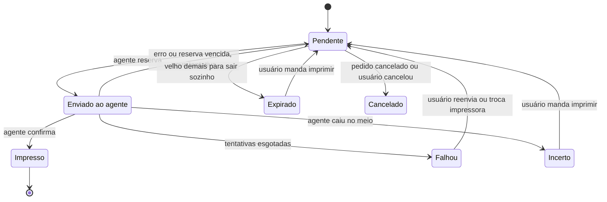
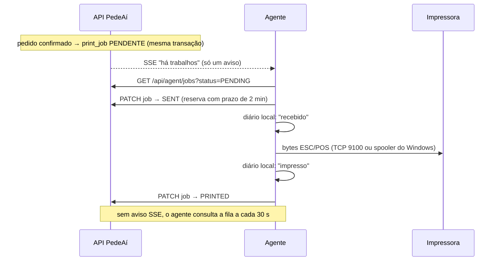

# 04 · Impressão

A impressão é a parte do sistema que mais encosta no mundo físico. Uma
impressora desligada, sem papel ou com o driver errado não pode fazer um pedido
sumir, e também não pode imprimir o mesmo pedido duas vezes.

## O que precisa funcionar

- Imprimir o pedido completo, só os itens da cozinha, ou as bebidas no bar.
- Imprimir automaticamente quando o pedido é confirmado, inclusive pedido do
  iFood chegando sem ninguém olhando a tela.
- Escolher qual impressora recebe cada tipo de pedido e cada setor.
- Reimprimir.
- Perceber quando uma impressora está indisponível e avisar.
- Nunca imprimir em dobro por acidente.
- Impressoras térmicas comuns de 58mm e 80mm, por rede ou USB, com ESC/POS.
- Instalação possível para um restaurante sem equipe de TI.

## Por que não imprimir direto do navegador

O PedeAí roda na nuvem, e as impressoras estão na rede do restaurante. Todas as
formas de fazer o navegador falar direto com a impressora esbarram em algum
limite:

| Abordagem | Problema |
| --- | --- |
| `window.print()` | Abre o diálogo de impressão e exige clique. Não escolhe impressora por setor. Só funciona com a aba aberta. |
| Chrome com `--kiosk-printing` | Imprime sem diálogo, mas só na impressora padrão e só com a aba aberta. Frágil. |
| WebUSB / Web Serial | Só Chrome e Edge. No Windows, o driver da impressora costuma prender o dispositivo USB. Pede permissão por dispositivo. Não alcança impressora de rede. Não imprime com a aba fechada. |
| Navegador chamando um programa em `localhost` | Desde o Chrome 142, um site público que acessa `localhost` ou a rede local precisa de permissão explícita do usuário (Local Network Access). E continua dependendo da aba aberta para imprimir sozinho. |
| Servidor na nuvem abrindo conexão com a impressora | A nuvem não enxerga a rede do restaurante (NAT). Exigiria abrir porta no roteador ou VPN. |
| QZ Tray | Produto de terceiros, com licença para uso sem aviso, e continua dependendo do navegador aberto. |
| **Agente local que busca trabalhos no servidor** | Exige instalar um programa em um computador. **É a abordagem escolhida.** |

A impressão pelo navegador (`window.print()` com layout de 58/80mm) continua
existindo como **contingência manual**: funciona com qualquer impressora que tem
driver, sem agente. Uma loja muito pequena pode começar só com ela, sem
impressão automática.

## Arquitetura escolhida



Princípios:

1. **O servidor decide o quê e onde.** Regras, roteamento por setor e layout
   (já convertido em bytes ESC/POS para o perfil daquela impressora) são
   calculados no servidor.
2. **O agente só entrega bytes.** Ele recebe o trabalho, manda para a impressora
   e informa o resultado. Por ser simples, quase nunca precisa de atualização no
   computador do restaurante.
3. **Conexão de saída.** O agente chama o servidor por HTTPS. Não precisa abrir
   porta, configurar roteador, ter IP fixo nem dar permissão no navegador.
4. **Funciona sem ninguém olhando.** Com o computador ligado e o agente rodando,
   o pedido do iFood imprime sozinho.
5. **O banco é a fila.** O trabalho de impressão é gravado na mesma transação
   que confirma o pedido. Se o pedido foi confirmado, a impressão existe.

## O que o restaurante configura

1. **Agentes:** "Adicionar computador de impressão" gera um código de 6 dígitos.
   O código é digitado no agente na primeira execução.
2. **Impressoras:** o agente informa as impressoras instaladas no Windows, e a
   tela sugere essas. Impressoras de rede são cadastradas por IP e porta (9100).
   Cada impressora tem largura do papel, colunas, tabela de caracteres, tipo de
   corte e bip, e um botão **Imprimir teste**.
3. **Setores:** cada setor (Cozinha, Bar, Pizzaria) aponta para uma impressora,
   com impressora reserva opcional e número de cópias.
4. **Regras:** quais documentos saem sozinhos, quando e onde.

### Regras de impressão

Uma regra combina **documento**, **gatilho**, **filtros** e **destino**:

| Campo | Valores |
| --- | --- |
| Documento | `PRODUCTION_TICKET` (itens de um setor), `ORDER_TICKET` (via completa), `CANCELLATION_TICKET`, `PRE_BILL` (pré-conta) |
| Gatilho | `ON_RECEIVED`, `ON_CONFIRMED`, `ON_DISPATCHED`, `ON_CANCELLED`, `MANUAL` |
| Filtros | Tipo do pedido (delivery, retirada, salão) e origem (PedeAí, iFood, 99Food). Vazio vale para todos. |
| Destino | Impressora fixa ou, para produção, a impressora de cada setor. Número de cópias. |

Configuração típica, criada com a loja e ajustável:

| Regra | Exemplo |
| --- | --- |
| Produção ao confirmar, qualquer pedido | Cozinha → Elgin 80mm (rede); Bar → Epson 58mm (USB) |
| Via completa ao confirmar, delivery próprio | Caixa, 2 cópias (uma vai com o entregador) |
| Via completa ao confirmar, iFood e 99Food | Caixa, 1 cópia |
| Salão | Só produção. Pré-conta no Caixa quando o garçom pede. |
| Cancelamento | Aviso automático nos setores que já receberam o pedido |

## Documentos

Exemplos em 80mm (48 colunas). Na impressora real, o cabeçalho sai em fonte
dupla e os nomes dos itens de produção em negrito.

**Ticket de produção (cozinha):** só os itens do setor, letra grande, sem preço.

```
================================================
              COZINHA - PEDIDO 42
================================================
DELIVERY - iFood 7391                24/09 19:42
Cliente: Maria S.
------------------------------------------------
2x X-BURGER
   + Bacon
   + Sem cebola
   OBS: carne bem passada
1x FRITAS GRANDE
------------------------------------------------
Impresso 19:42:15
```

**Via completa (caixa, expedição, entregador):**

```
              RESTAURANTE EXEMPLO
             Não é documento fiscal
================================================
PEDIDO 42                             iFood 7391
DELIVERY - entrega pelo iFood
24/09/2026 19:42
------------------------------------------------
Cliente: Maria S.
Tel: 0800 000 0000  Localizador: 1234 5678
Rua das Flores, 123 - ap 45 - Centro
Ref.: portão azul
------------------------------------------------
QTD ITEM                                   VALOR
 2  X-BURGER                               59,80
      + Bacon                               8,00
      + Sem cebola
    OBS: carne bem passada
 1  FRITAS GRANDE                          22,00
------------------------------------------------
Subtotal                                   89,80
Taxa de entrega                             7,00
Desconto (cupom pago pelo iFood)          -10,00
TOTAL                                      86,80
------------------------------------------------
Pagamento: online, pago no iFood
================================================
```

**Aviso de cancelamento:**

```
################################################
        *** CANCELADO - NÃO PREPARAR ***
################################################
PEDIDO 42 - COZINHA                        19:58
Motivo: cliente desistiu
------------------------------------------------
2x X-BURGER
1x FRITAS GRANDE
################################################
```

Outros documentos:

- **Pré-conta:** itens da comanda, taxa de serviço opcional, total e valor por
  pessoa.
- **Acréscimo:** item adicionado a um pedido já impresso sai num ticket só com a
  diferença, marcado ACRÉSCIMO.
- **Reimpressão:** o mesmo documento com a faixa `*** REIMPRESSÃO ***` e o
  horário original.
- **Fechamento de caixa:** na Etapa 7.

Os layouts são código (um por documento), com poucas opções configuráveis:
mostrar preço no ticket de produção, tamanho da fonte dos itens e se o telefone
do cliente sai na via. Um editor visual de layout não entra no escopo.

A renderização passa por um modelo intermediário, `TicketDocument`: linhas com
estilo (alinhamento, negrito, tamanho, separador, QR code). Dois renderizadores
usam esse modelo:

- `EscPosRenderer` gera os bytes para a impressora.
- `HtmlRenderer` gera a **prévia na tela** e a **impressão de contingência pelo
  navegador**.

## Roteamento

```
ao confirmar o pedido (ou ao ele já nascer confirmado):
  para cada regra ativa com gatilho ON_CONFIRMED que casa com o tipo e a origem do pedido:
    se o documento é PRODUCTION_TICKET:
      agrupar os itens ativos por setor (setor do item → da categoria → padrão da loja)
      para cada setor com impressão habilitada:
        impressora = principal do setor
                     (ou a reserva, se a principal está offline e a reserva online)
        criar print_job com chave "order:{id}:PRODUCTION:{setor}:ON_CONFIRMED"
    senão:
      criar print_job na impressora da regra, com as cópias,
                      chave "order:{id}:{documento}:{regra}:ON_CONFIRMED"
```

- Se não há impressora configurada, o sistema não trava a confirmação. Registra
  um alerta: "Setor Bar sem impressora".
- Um item de marketplace sem código PDV vai para o setor padrão e sai com a
  marca "item não mapeado".
- Se o pedido é cancelado antes de imprimir, os trabalhos pendentes são
  cancelados. O aviso de cancelamento só vai para os setores que já imprimiram.

## Ciclo de vida de um trabalho





- **Reserva com prazo:** ao reservar, o trabalho ganha `lease_until`. Se o
  agente não responder até lá, o trabalho volta a Pendente.
- **Nova tentativa com espera:** erros transitórios, como impressora recusando
  conexão, voltam a Pendente com espera crescente (5 s, 15 s, 30 s, 1 min…).
  Depois de 5 tentativas o trabalho vira **Falhou** e aparece em destaque.
- **Expiração:** um trabalho pendente velho demais não sai sozinho. Sem essa
  regra, uma impressora que volta depois de uma hora imprimiria uma rajada de
  tickets de pedidos já entregues. Valores iniciais: produção 20 min, demais 60
  min. Os expirados aparecem no painel **Impressões** com um botão "imprimir
  agora".

## Evitando impressão duplicada

A proteção é em camadas:

1. **Na origem (servidor):** cada impressão automática tem uma **chave de
   idempotência** derivada do evento que a causou, com `UNIQUE` no banco.
   Processar de novo o mesmo evento (um webhook reenviado, um retry) não cria
   um segundo trabalho.
2. **Na ação humana:** reimprimir é explícito e sai marcado REIMPRESSÃO. O botão
   envia um header `Idempotency-Key` gerado por clique, e o duplo clique vira
   uma requisição só.
3. **No agente:** cada trabalho traz uma **chave de entrega**. O agente mantém um
   diário local (arquivo simples, últimos 7 dias) e **nunca imprime a mesma chave
   duas vezes**. Se o servidor reenviar um trabalho, por exemplo porque a
   confirmação se perdeu na rede, o agente responde "já impresso" sem imprimir.
   Quando uma pessoa pede para imprimir de novo, o servidor gera uma chave de
   entrega nova.
4. **No caso raro de dúvida:** o agente grava "recebido" antes de imprimir e
   "impresso" depois. Se ele cair entre os dois (computador desligado no meio),
   não dá para saber se saiu papel. Nesse caso o agente não adivinha: marca
   **Incerto**, e a tela pergunta "O pedido 42 pode não ter sido impresso na
   Cozinha. Imprimir?".
5. **Na implantação:** se a loja usa outro programa que também imprime pedidos
   do iFood (como o gestor de pedidos do próprio iFood), a impressão automática
   dele precisa ser desligada. Isso faz parte do checklist de implantação.

## Impressora indisponível

### Como detectar

| Sinal | Como |
| --- | --- |
| Agente fora do ar | O agente manda um heartbeat a cada 20 s (`PUT /api/agent/status`). Sem heartbeat por 60 s, o agente está **offline**. |
| Impressora de rede desligada | O agente testa a conexão TCP de tempos em tempos, só quando a impressora está ociosa. Precisa de 2 falhas seguidas para marcar offline, porque algumas impressoras aceitam uma conexão por vez. |
| Sem papel, tampa aberta | Em impressoras de rede, o comando ESC/POS de status em tempo real (`DLE EOT`) informa papel e tampa. Se o modelo não responde, o status fica "online (sem detalhes)". |
| Impressora USB (spooler do Windows) | O spooler aceita o trabalho mesmo sem papel. O agente acompanha a fila: se os trabalhos não andam por mais de 60 s, marca **fila parada**. É uma limitação do spooler. Por isso recomendamos impressora **de rede na cozinha**. |
| Falha ao enviar | Todo erro de envio atualiza o status da impressora na hora. |

### Como reagir

- **Faixa de alerta** em todas as telas da loja, via SSE: "Impressora Cozinha
  offline: 3 pedidos aguardando", com som.
- **Impressora reserva:** se a principal do setor está offline e a reserva
  online, os trabalhos novos vão para a reserva automaticamente.
- **Redirecionar pendentes:** botão "enviar pendentes para outra impressora".
- **Tela da cozinha:** continua mostrando os pedidos com ou sem papel.
- **Contingência pelo navegador:** qualquer documento pode sair por
  `window.print()` numa impressora com driver.
- **Quando volta:** os pendentes recentes saem sozinhos. Os expirados ficam
  listados para decisão humana.

## Reimpressão

- Do detalhe do pedido ou da comanda: escolhe o documento (produção de um setor,
  via completa ou pré-conta) e a impressora (a sugerida vem pré-selecionada).
- Sai com a faixa REIMPRESSÃO e o horário original, para a cozinha não preparar
  de novo achando que é pedido novo.
- Fica na auditoria (quem, quando, qual documento). A cozinha só reimprime
  tickets de produção.

## ESC/POS na prática

| Papel | Colunas (fonte A) | Colunas (fonte B) |
| --- | --- | --- |
| 58mm | 32 | 42 |
| 80mm | 48 | 64 |

O número de colunas varia por modelo, por isso é configurável. A página de teste
imprime uma régua para conferir.

| Função | Comando |
| --- | --- |
| Inicializar | `ESC @` |
| Tabela de caracteres | `ESC t n` |
| Alinhamento | `ESC a n` |
| Negrito | `ESC E n` |
| Altura e largura dupla | `GS ! n` |
| Avançar linhas | `ESC d n` |
| Corte total ou parcial | `GS V m` |
| Abrir gaveta de dinheiro | `ESC p m t1 t2` |
| Status em tempo real | `DLE EOT n` |
| QR Code | `GS ( k` |

- **Acentos:** o `n` da tabela de caracteres (PC850, PC860 português,
  WPC1252…) muda de fabricante para fabricante. É configuração da impressora. A
  página de teste imprime `ÁÉÍÓÚ ÂÊÔ ÃÕ Ç`, e a pessoa escolhe a opção que saiu
  certa. Se nenhuma sair, existe a opção "remover acentos".
- **Corte e bip** também variam: são configuráveis e desligáveis.
- **Modelos nacionais:** Epson, Elgin, Bematech, Daruma, Tanca, Knup e outros
  falam ESC/POS. Alguns também têm um modo de comandos próprio, que o utilitário
  do fabricante troca para ESC/POS.
- **Encoder próprio:** usamos um encoder ESC/POS pequeno e nosso (poucos
  comandos, testado com golden files). Evita depender de biblioteca pouco
  mantida.

## O agente

| Tema | Decisão |
| --- | --- |
| Linguagem | Java 21 puro, sem Spring, com poucas dependências. É a mesma linguagem do backend. |
| Entrega | Instalador MSI gerado por `jpackage`, com o runtime Java embutido (cerca de 50 MB). **Não precisa instalar Java.** |
| Execução | Inicia com o Windows, com ícone na bandeja: verde (ok), amarelo (impressora com problema) e vermelho (sem conexão). Opção de rodar como serviço do Windows para computador sem usuário logado. |
| Primeira execução | Pede a URL, que já vem preenchida, e o código de pareamento. Pronto. |
| Credencial | Token de dispositivo, que só serve para imprimir e pode ser revogado na tela. |
| Impressoras | Rede: socket TCP (porta 9100). USB: envio RAW pelo spooler do Windows, pelo nome da impressora (driver do fabricante ou "Generic / Text Only"). |
| Diário local | Arquivo com as chaves de entrega e o resultado dos últimos 7 dias. |
| Logs | Na pasta do usuário, com rotação. A tela de configurações mostra os últimos erros enviados no heartbeat. |
| Atualização | O servidor informa a versão mais recente e a tela avisa. Atualização automática fica para depois. |
| Assinatura | Assinar o instalador (certificado de assinatura de código) evita o alerta do SmartScreen. No piloto, sem assinatura, com instrução. |
| Mais de um agente | Permitido. Por exemplo: um no caixa e outro no computador da cozinha, com impressora USB. Cada impressora pertence a um agente. |
| Futuro | Agente Android com o mesmo protocolo, para maquininhas com impressora embutida e impressoras Bluetooth. O agente também pode virar ponte para gaveta, balança e TEF. |

### Protocolo agente ↔ servidor

| Chamada | Uso |
| --- | --- |
| `POST /api/agent/pairings` | Troca o código de pareamento pelo token. É a única chamada sem token. |
| `GET /api/agent/config` | Impressoras deste agente (conexão, colunas, tabela de caracteres) e a versão mais recente do agente. |
| `GET /api/agent/stream` | SSE com os avisos `jobs-available` e `config-changed`. |
| `GET /api/agent/jobs?status=PENDING` | Trabalhos das impressoras deste agente, com os bytes em base64. |
| `PATCH /api/agent/jobs/{id}` | `SENT` (reserva; `409` se outro já reservou), `PRINTED`, `FAILED` com erro, `UNCERTAIN`. |
| `PUT /api/agent/status` | Heartbeat a cada 20 s, com o status de cada impressora. |
| `PUT /api/agent/discovered-printers` | Impressoras instaladas no Windows, para facilitar o cadastro. |

## Testes

- **Golden files:** para cada documento e largura (58mm e 80mm), os bytes
  ESC/POS gerados são comparados com um arquivo esperado.
- **Impressora falsa:** um servidor TCP de teste recebe os bytes. Serve para
  simular recusa de conexão, queda no meio do envio e lentidão.
- **Duplicidade:** testes que reiniciam o agente no meio de um trabalho e
  reenviam trabalhos já impressos. Nada pode sair duas vezes.
- **Manual:** o botão **Imprimir teste** em cada impressora e uma checklist por
  modelo homologado.

## Primeiro passo recomendado: protótipo de impressão

Antes de construir o módulo inteiro, um protótipo de um dia: o agente mínimo
imprime um ticket com acentos, fonte dupla e corte **nas impressoras reais do
restaurante-piloto** (uma USB pelo Windows e uma de rede). O protótipo valida
tabela de caracteres, colunas, corte e driver, que são as maiores incertezas,
com custo baixo.
