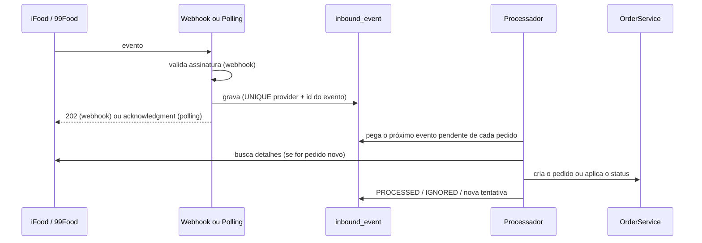

# 05 · Integrações com marketplaces

Objetivo: pedidos do iFood e da 99Food entram no PedeAí e seguem **o mesmo
fluxo** dos outros pedidos. O funcionário não alterna entre telas, e as mudanças
de status voltam para a plataforma sozinhas.

> **Sobre as fontes.** As informações abaixo vêm da documentação oficial do
> [iFood Developer](https://developer.ifood.com.br), da
> [99Food Open Platform](https://developer-food.99app.com) e da especificação
> [Open Delivery](https://abrasel-nacional.github.io/opendelivery/). Nesta
> análise, a rede do ambiente bloqueou a leitura direta desses portais. O
> conteúdo foi levantado pelos trechos indexados das páginas oficiais. Os pontos
> marcados com ⚠️ precisam ser conferidos na referência completa antes da etapa
> correspondente (lista em [Pendências](#pendências-para-validar-na-documentação-oficial)).

## Princípios

1. **Camada anticorrupção.** O modelo do iFood ou da 99Food nunca vaza para o
   núcleo. Cada adaptador traduz para um modelo normalizado (`ExternalOrder`), e
   o núcleo cria um `Order` comum.
2. **Entrada pelo inbox, saída pelo outbox.** Todo evento recebido é gravado
   antes de ser processado. Toda ação a enviar é gravada na mesma transação da
   mudança de status. Nada depende de a rede funcionar naquele exato momento.
3. **Idempotência em tudo.** Eventos chegam repetidos, fora de ordem e por dois
   caminhos (webhook e polling). O sistema precisa aguentar isso sem duplicar
   pedido nem status.
4. **Não devolver o eco.** Uma mudança de status que *veio* da plataforma não é
   enviada de volta para ela.
5. **Decisão de dinheiro é humana.** Disputas e pedidos de cancelamento do
   cliente viram uma pergunta na tela, com prazo. O próprio iFood recomenda não
   automatizar essas decisões.
6. **Reconciliação.** Um job periódico compara os pedidos abertos com o estado
   na plataforma e corrige desvios, cobrindo eventos perdidos.

## Estrutura do módulo

```
integration/
├── controller, service, repository, dto, domain   núcleo: inbox, outbox, vínculos, processamento
├── ifood/          IfoodConnector, IfoodAuthClient, IfoodOrderMapper, IfoodWebhookController, IfoodPollingJob
└── opendelivery/   OpenDeliveryConnector, OpenDeliveryOrderMapper, OpenDeliveryWebhookController
                    (a 99Food é uma configuração deste adaptador)
```

```java
public interface MarketplaceConnector {
    Provider provider();                                    // IFOOD, NINETY_NINE_FOOD

    // entrada
    List<InboundEventData> poll(Collection<String> merchantIds);
    void acknowledge(Collection<String> eventIds);
    boolean hasValidSignature(byte[] rawBody, HttpHeaders headers);
    ExternalOrder fetchOrder(ExternalOrderRef ref);

    // saída
    void confirm(ExternalOrderRef ref);
    void startPreparation(ExternalOrderRef ref);
    void ready(ExternalOrderRef ref);
    void dispatch(ExternalOrderRef ref);
    List<CancellationReason> cancellationReasons(ExternalOrderRef ref);
    void requestCancellation(ExternalOrderRef ref, String reasonCode, String description);
}
```

`ExternalOrder` é um `record` com o que o núcleo precisa: identificadores
(`externalId`, `displayId`, `merchantId`), tipo, agendamento, quem entrega
(loja ou plataforma), cliente, endereço, itens com opções e **código PDV**,
totais, descontos com **quem paga**, pagamentos (online ou na entrega, troco) e
observações.

## Entrada: eventos



- **Responder rápido, processar depois.** O webhook grava e responde. O iFood
  exige `202` em até 5 segundos. O processamento é assíncrono.
- **Deduplicação:** `UNIQUE(provider, external_event_id)` no inbox. O mesmo
  evento pelo webhook e pelo polling é gravado uma vez.
- **Ordem por pedido:** eventos do mesmo pedido são processados em sequência;
  pedidos diferentes são processados em paralelo. Um evento de status que chega
  antes do pedido existir faz o processador buscar e criar o pedido primeiro.
- **Status repetido ou "para trás":** a máquina de estados é idempotente. Aplicar
  `CONFIRMED` num pedido já `READY` não faz nada.
- **Merchant sem vínculo:** o evento vira `IGNORED`, com o motivo, e aparece no
  diagnóstico.
- **Payload cru** fica guardado em `TEXT` por 30 dias, para suporte e auditoria.

## Saída: status

- Quando um pedido de marketplace muda de status **por ação local**, um listener
  na mesma transação grava uma `outbound_action`. Um worker envia a ação com
  retentativa.
- As ações de um mesmo pedido saem **em ordem**. `DISPATCH` não sai antes de
  `CONFIRM`. Uma ação que perdeu o sentido, por exemplo porque o pedido foi
  cancelado nesse meio-tempo, vira `SKIPPED`.
- **Otimista para o fluxo, pessimista para o cancelamento.** Confirmar, preparar
  e pronto mudam na tela na hora, e a sincronização acontece em segundo plano,
  com indicador no pedido ("sincronizando", "erro ao sincronizar: tentar de
  novo"). O cancelamento só acontece de fato quando a plataforma confirma.

### Mapeamento de status

| PedeAí | Enviado ao iFood | Recebido do iFood | Open Delivery / 99Food ⚠️ |
| --- | --- | --- | --- |
| Recebido | — | `PLACED` (`PLC`) | evento de pedido criado |
| Confirmado | `POST /order/v1.0/orders/{id}/confirm` | `CONFIRMED` (`CFM`) | confirmar pedido |
| Em preparo | `POST …/orders/{id}/startPreparation` | ⚠️ conferir o código do evento | ⚠️ conferir se existe no padrão |
| Pronto | `POST …/orders/{id}/readyToPickup` (retirada; entrega do iFood ⚠️) | `READY_TO_PICKUP` (`RTP`) | pronto para retirada |
| Saiu para entrega | `POST …/orders/{id}/dispatch`, quando **a loja** entrega (`deliveredBy = MERCHANT`) | `DISPATCHED` (`DSP`) | despachado |
| Concluído | — (a plataforma conclui) | `CONCLUDED` (`CON`) | concluído |
| Cancelado | `POST …/orders/{id}/requestCancellation`, com motivo de `GET …/cancellationReasons` | `CANCELLED` (`CAN`) | pedido de cancelamento / cancelado |

## Mapeamento de dados

| Dado | Regra |
| --- | --- |
| **Itens** | Casados pelo **código PDV**: o código cadastrado no cardápio do iFood ou da 99Food é igual ao `code` do produto no PedeAí. Opções são casadas pelo código do `option_item`. Sem correspondência, o item entra com o nome da plataforma, no setor padrão, marcado "não mapeado". A tela "Itens não mapeados" ajuda a corrigir o cardápio. |
| **Tipo** | iFood `DELIVERY` → `DELIVERY`; `TAKEOUT` → `TAKEOUT`; `DINE_IN` → `DINE_IN`, sem comanda. `INDOOR` está indisponível hoje, segundo a documentação. |
| **Agendamento** | `orderTiming = SCHEDULED` preenche `scheduled_for`, e o pedido aparece em "Agendados". |
| **Quem entrega** | `deliveredBy` (loja ou plataforma) decide se o PedeAí envia `dispatch` e o que sai na via completa. |
| **Pagamentos** | Online (pago na plataforma) vira `payment` com status `PAID` e forma "Online iFood". Na entrega vira `PENDING`, com forma e **troco para**. |
| **Descontos** | Os `benefits` do iFood trazem o patrocínio de cada parte. A parte da loja vai para `discount_cents`, a parte da plataforma para `platform_subsidy_cents`. O faturamento fica correto. |
| **Cliente** | Nome, telefone e localizador ficam **só no snapshot do pedido**. Não entram na base de clientes da loja (LGPD e termos da plataforma). |
| **Valores** | A plataforma manda decimais. O adaptador converte para centavos com checagem de escala. |

## Cancelamento

- **Pela loja:** a tela busca os motivos aceitos para aquele pedido naquele
  momento (`/cancellationReasons`) e a pessoa escolhe um. O PedeAí envia
  `/requestCancellation`, e o pedido fica "cancelamento solicitado" até chegar o
  evento `CANCELLED`. Aí o cancelamento é aplicado e os setores recebem o aviso.
- **Pela plataforma ou pelo cliente:** o evento de cancelamento cancela o pedido,
  toca um alerta e imprime o aviso nos setores que já receberam o pedido.
- **Negociação (iFood):** o evento `HANDSHAKE_DISPUTE` traz o pedido do cliente
  (cancelamento total ou parcial, reembolso), as evidências, o **prazo** e a
  **ação automática** caso ninguém responda. O PedeAí abre um modal com prazo
  regressivo e as opções da plataforma: aceitar, rejeitar ou propor
  alternativa. A disputa só pode ser respondida uma vez. Sem resposta, vale a
  ação automática da plataforma.

## Autenticação e vínculo da loja

### iFood

- O PedeAí é um **aplicativo centralizado**: um SaaS com uma credencial que
  atende várias lojas. Usa o grant `client_credentials`, sem refresh token.
  Webhook só existe para aplicativos centralizados.
- `clientId` e `clientSecret` ficam em variáveis de ambiente. O token é pedido a
  `…/authentication/v1.0/oauth/token` e renovado **pelo `expiresIn` recebido**
  (padrão de 6 horas, que pode mudar). Um `401` renova o token uma vez e repete
  a chamada.
- **Vínculo:** o dono da loja aceita, no **Portal do Parceiro** do iFood, a
  permissão para o aplicativo PedeAí (usuário com perfil de gestão, de
  preferência "Dono"). Depois disso, o PedeAí lista os merchants que a
  credencial alcança, e o dono escolhe a sua loja.
- **Segurança do vínculo:** `UNIQUE(provider, external_merchant_id)` impede que
  duas lojas usem o mesmo merchant. O vínculo também confere o CNPJ/nome do
  merchant com o da loja, para que ninguém ligue o iFood de outro restaurante à
  própria conta.

### 99Food

- A 99Food tem sua **Open Platform**, com APIs e webhooks de loja, cardápio e
  pedidos, e **concluiu a adesão ao padrão Open Delivery** em novembro de 2025.
  O Keeta também aderiu.
- **Proposta:** implementar o adaptador `opendelivery` e configurar a 99Food nele.
  Se a API própria da 99Food tiver algo essencial fora do padrão, o adaptador
  chama esse endpoint específico. ⚠️ Confirmar no portal qual API é recomendada
  para PDV e qual versão.
- Pelas centrais de ajuda de integradores que já operam com a 99Food, o
  processo tem três passos. ⚠️ Confirmar no portal oficial.
  1. A loja **autoriza a integradora** no portal da 99Food antes de tudo.
  2. A loja preenche os **códigos PDV** no cardápio da 99Food.
  3. A loja usa a ferramenta de **pedido de teste** do painel da 99Food para
     validar.
- As credenciais por loja, se existirem nesse modelo, ficam **cifradas** em
  `marketplace_connection.credentials_encrypted`.
- Suporte técnico da 99Food para integradores: 99FoodTechSupport@didiglobal.com.

## Regras da plataforma que o PedeAí precisa cumprir

### iFood

| Regra | Como o PedeAí atende |
| --- | --- |
| Polling a cada **30 s** em `GET /events:polling`. É o polling que mantém a loja online. | Job agendado a cada 30 s (ShedLock com mais de uma instância). |
| Com muitas lojas, filtrar por loja no header `x-polling-merchants`, com até 100 IDs por requisição. Acima de 500 lojas, é obrigatório dividir em lotes de 100. | O job agrupa as conexões ativas em lotes de 100. |
| `POST /events/acknowledgment` para **todos** os eventos recebidos, logo após o polling, **uma vez** por evento. | O ack sai depois de gravar no inbox. Se o ack falhar, o evento pode voltar, e o inbox deduplica. |
| Limite de taxa: polling tem 1 requisição a cada 30 s por token; exceder retorna `429`. | Backoff exponencial em `429` e intervalo fixo no polling. |
| Webhook: assinatura HMAC-SHA256 do **corpo cru** com o `clientSecret`, no header `X-IFood-Signature`. | O controller lê `byte[]` antes de qualquer parse de JSON. Comparação em tempo constante. |
| Webhook: responder `202` em até **5 s**. O iFood tenta reenviar por até 15 min. | Grava no inbox e responde. |
| Eventos de webhook descartados **não são recuperados**. Usar polling como contingência. | Polling de contingência e reconciliação dos pedidos abertos. ⚠️ Confirmar como webhook e polling convivem no mesmo aplicativo. |
| Presença no webhook por heartbeats. O endpoint recebe eventos de presença até 30 s após o cadastro. | Endpoint responde aos eventos de presença e registra "última presença" para o painel de saúde. |
| Pedido não confirmado em **8 minutos** é cancelado pelo iFood, inclusive retirada. | Alerta crescente a partir de 3 min e aceite automático opcional. |
| Cancelamento só com motivo vindo de `/cancellationReasons`, escolhido pelo usuário. | Tela de cancelamento com a lista da plataforma. |
| **Homologação** obrigatória. Se os requisitos não forem cumpridos, é preciso esperar 15 dias para tentar de novo. | Checklist de homologação extraído da página oficial de critérios, validado internamente antes de agendar. |

### 99Food (Open Delivery)

| Regra (especificação Open Delivery) | Como o PedeAí atende |
| --- | --- |
| Polling: `200` com lista de eventos ou `204` sem eventos. Todo evento recebido por polling precisa de **acknowledgment**, senão volta nas próximas consultas. | Mesmo job e mesmo inbox do iFood. |
| O acknowledgment **não se aplica a webhooks**. O webhook espera `200`. | O controller responde `200` depois de gravar no inbox. |
| Webhook assinado no header `X-App-Signature`: HMAC-SHA256 do corpo com o client secret, em hexadecimal minúsculo. | Validação sobre o corpo cru, em tempo constante. |

## Tratamento de erros

| Situação | Comportamento |
| --- | --- |
| Assinatura inválida no webhook | `401`, nada é gravado, log de segurança e métrica |
| Evento repetido (webhook e polling, reenvio) | `UNIQUE` no inbox: ignorado |
| Evento de merchant sem vínculo | `IGNORED` com motivo; aparece no diagnóstico |
| `401` na API da plataforma | Renova o token uma vez e repete |
| `429` | Espera o `Retry-After` ou faz backoff exponencial com jitter |
| `5xx` ou timeout | Retentativa com backoff por até ~30 min. Depois vira `FAILED`, com alerta na loja. |
| `4xx` de regra (ação inválida no estado atual) | Não repete. Busca o pedido na plataforma, **reconcilia** o status local e avisa na tela. |
| Webhook fora do ar ou evento perdido | Polling de contingência e reconciliação periódica |
| Pedido recebido sem aceite | Alerta sonoro repetido a partir de 3 min. Aceite automático opcional. |

## Painel de saúde da integração

Por loja: status da conexão, último evento recebido, última presença, ações
pendentes e com falha, último erro e botão "sincronizar agora". Na operação do
PedeAí: métricas de atraso do inbox, falhas por plataforma e taxa de `429` e
`5xx`.

## Implantação de uma loja

1. **Uma vez, pelo PedeAí:** cadastro no iFood Developer, aplicativo
   centralizado, credenciais no ambiente, URL de webhook, desenvolvimento e
   homologação. Na 99Food, o credenciamento como integradora.
2. **Loja:** aceita a permissão do PedeAí no Portal do Parceiro do iFood e
   autoriza a integradora no portal da 99Food.
3. **Loja, no PedeAí:** Integrações → escolhe o merchant (iFood) ou informa os
   dados da loja (99Food). O vínculo é conferido e ativado.
4. **Cardápio:** preenche os códigos PDV nas plataformas. O relatório "itens não
   mapeados" mostra o que falta.
5. **Operação:** decide sobre o aceite automático e **desliga a impressão e o
   aceite automáticos de outros programas**, para não duplicar.
6. **Teste:** pedido de teste (loja teste do iFood; ferramenta de pedido de teste
   da 99Food) passando por aceite, cozinha, impressão, pronto e conclusão.

## Desenvolvimento e testes

- **WireMock** simula as APIs: token, polling, ack, detalhes do pedido e ações,
  com `401`, `429`, `5xx` e timeouts.
- **Fixtures** com os payloads de exemplo da documentação oficial. Os testes de
  mapeamento cobrem pedido com adicionais, cupom da plataforma, pagamento em
  dinheiro com troco, pedido agendado e retirada.
- **Simulador de marketplace** (só no perfil `local`): um endpoint injeta pedidos
  falsos do iFood e da 99Food no inbox. Serve para desenvolver e demonstrar sem
  credenciais reais, e passa pelo mesmo caminho do pedido real.
- **Ambientes das plataformas:** a loja teste que o iFood disponibiliza para
  aplicativos centralizados e o pedido de teste do painel da 99Food.

## Pendências para validar na documentação oficial

Antes da Etapa 5 (iFood):

- Formato completo do payload do webhook e configuração do modo de presença.
- Se webhook e polling podem ficar ativos ao mesmo tempo no mesmo aplicativo, e
  como o iFood recomenda a contingência.
- Código do evento de início de preparo. Uso de `readyToPickup` em entrega feita
  pelo iFood.
- Checklist completo de homologação e limites de taxa por endpoint.
- Caminhos dos endpoints da plataforma de negociação e das respostas às
  disputas.

Antes da Etapa 6 (99Food):

- API recomendada (Open Delivery ou endpoints próprios da Open Platform) e
  versão.
- Modelo de credenciais: da integradora ou por loja.
- Nomes exatos de eventos e ações de status, configuração do webhook e processo
  de certificação da integradora.

## Fontes

- iFood Developer: [visão geral](https://developer.ifood.com.br/pt-BR/docs/getting-started) ·
  [autenticação](https://developer.ifood.com.br/pt-BR/docs/guides/modules/authentication/intro/) ·
  [aplicativos centralizados](https://developer.ifood.com.br/pt-BR/docs/guides/modules/authentication/centralized/) ·
  [polling de eventos](https://developer.ifood.com.br/en-US/docs/guides/modules/events/polling-overview/) ·
  [webhook](https://developer.ifood.com.br/pt-BR/docs/guides/modules/events/webhook-overview/) ·
  [conceitos do webhook](https://developer.ifood.com.br/pt-BR/docs/guides/modules/events/webhook-request/) ·
  [assinatura do webhook](https://developer.ifood.com.br/pt-BR/docs/guides/modules/events/webhook-signature/) ·
  [presença no webhook](https://developer.ifood.com.br/en-US/docs/guides/order/events/delivery-methods/webhook/presence/) ·
  [guia de implementação de pedidos](https://developer.ifood.com.br/en-US/docs/guides/modules/order/workflow/) ·
  [detalhes do pedido](https://developer.ifood.com.br/pt-BR/docs/guides/modules/order/details/) ·
  [eventos de pedido](https://developer.ifood.com.br/en-US/docs/guides/modules/order/events/) ·
  [plataforma de negociação](https://developer.ifood.com.br/pt-BR/docs/guides/modules/order/handshake-platform/) ·
  [critérios de homologação](https://developer.ifood.com.br/pt-BR/docs/guides/modules/order/homologation/) ·
  [limite de taxa](https://developer.ifood.com.br/en-US/docs/getting-started/documentation/rate-limit/)
- 99Food: [portal de desenvolvedores](https://developer-food.99app.com/) ·
  [Open Platform](https://developer-food.99app.com/pt-BR/openapi) ·
  [99Food e Keeta concluem integração ao Open Delivery](https://opendelivery.com.br/sem-categoria/99food-e-keeta-concluem-integracao-ao-open-delivery/) ·
  [vitrine de aderentes do Open Delivery](https://aderentes.opendelivery.com.br/companies/68f696345e89f79a1563008a)
- Open Delivery: [especificação da API](https://abrasel-nacional.github.io/opendelivery/) ·
  [documentação do protocolo](https://docs.opendelivery.com.br/)
- Centrais de ajuda de integradores (referência de processo, não oficial):
  [Consumer](https://ajuda.programaconsumer.com.br/como-integrar-o-consumer-ao-99food/) ·
  [SW](https://atendimento.swfast.com.br/hc/pt-br/articles/41895007118107-Como-ativar-a-integra%C3%A7%C3%A3o-com-a-99Food) ·
  [PDV Legal](https://ajuda.pdvlegal.com.br/integracoes/integracao-com-99food)
