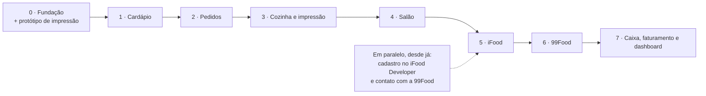

# 06 · Roadmap

Cada etapa entrega algo usável de ponta a ponta (backend, frontend e testes) e
só cria as tabelas que usa. Uma etapa só começa quando a anterior cumpre o
critério de pronto.

> A ordem segue as prioridades do projeto. Se o restaurante-piloto vender mais
> por delivery do que no salão, as Etapas 4 (Salão) e 5 (iFood) trocam de lugar.
> A arquitetura não depende dessa ordem.

## Etapa 0 · Fundação

- Monorepo, `compose.yaml` (PostgreSQL), `.env.example`, CI no GitHub Actions
  (backend, frontend e smoke test contra PostgreSQL real).
- Backend: Spring Boot 4.1, migração inicial do Flyway, `ApiError` e handler
  central, segurança (JWT e refresh token), `store` e `app_user`,
  `StoreContext`, `Clock` injetado, OpenAPI e regras ArchUnit.
- Frontend: Vite + TypeScript, rotas, login, layout, cliente HTTP com renovação
  de token, tipos gerados do OpenAPI, MSW e tema Mantine.
- **Protótipo de impressão (1 dia):** o agente mínimo imprime um ticket com
  acentos, fonte dupla e corte nas impressoras reais do piloto.

**Pronto quando:** o login funciona de ponta a ponta. Um usuário de outra loja
recebe `404` no teste padrão de IDOR. O CI está verde. O protótipo imprimiu
certo nas impressoras do piloto.

> **Situação (set/2026):** tudo feito, com o fluxo validado num navegador real
> contra PostgreSQL. Falta o protótipo de impressão, que depende de saber
> marca, modelo e conexão (USB ou rede) das impressoras do piloto.

## Etapa 1 · Cardápio

- Setores, categorias, produtos (código PDV, preço, setor, disponibilidade),
  grupos de adicionais (mínimo, máximo, regra de preço) e opções.
- Telas de cadastro e "pausar item" rápido.
- Cálculo do preço de item com adicionais: soma, maior valor e média, para pizza
  meio a meio.

**Pronto quando:** o cardápio real do piloto, inclusive pizza meio a meio, está
cadastrado, e os testes de preço cobrem cada regra.

> **Situação (set/2026):** API, telas e testes prontos. O cardápio de uma
> pizzaria (meio a meio pelo sabor mais caro, borda, bebida indo para o Bar) foi
> montado num navegador real contra PostgreSQL, inclusive pelo celular, e o caixa
> consegue pausar e liberar itens. Falta cadastrar o cardápio real do piloto.

## Etapa 2 · Pedidos

- Clientes, endereços e taxa de entrega por bairro. Formas de pagamento.
- Tela de novo pedido (PDV) para retirada e delivery: adicionais com validação,
  observações, troco.
- Máquina de estados, linha do tempo, numeração diária com virada do dia
  operacional, cancelamento com motivo.
- Quadro de pedidos em tempo real (SSE) e histórico paginado com filtros.
- Registro de pagamento no pedido.

**Pronto quando:** um pedido de delivery com adicionais, taxa e troco percorre
todos os status, em duas telas abertas que se atualizam sozinhas. Os totais
batem nos testes.

> **Situação (set/2026):** API, telas e testes prontos. Num navegador real contra
> PostgreSQL, o caixa lançou um delivery com pizza meio a meio, dois
> refrigerantes, taxa do bairro e troco para R$ 100 (total R$ 74,90, troco de
> R$ 25,10). O pedido percorreu todos os status em três telas abertas (caixa,
> dona e cozinha), que se atualizaram sozinhas em menos de um segundo. A cozinha
> só consegue iniciar o preparo e marcar pronto. No pedido seguinte, o mesmo
> telefone trouxe o cliente e o endereço salvos. Os totais batem nos testes de
> unidade e de integração, e a numeração diária foi testada com 8 pedidos
> lançados ao mesmo tempo.

## Etapa 3 · Cozinha e impressão

- Tela da cozinha: tela cheia, filtro por setor, cronômetro, iniciar, pronto e
  desfazer.
- Agente v1: pareamento, impressora de rede e spooler do Windows, diário local,
  heartbeat, instalador MSI.
- Impressoras, setores e regras. Impressão automática. Layouts de 58 e 80mm.
  Reimpressão. Alertas de impressora offline. Painel de impressões. Contingência
  pelo navegador.

**Pronto quando:**
- Um pedido confirmado imprime no setor certo em menos de 3 s: bebida no bar,
  comida na cozinha, via completa no caixa.
- Desligar uma impressora gera alerta em menos de 1 min.
- Religar a impressora imprime os pendentes recentes e lista os expirados.
- Reiniciar o agente no meio de um trabalho não duplica nada.
- A reimpressão sai marcada.

## Etapa 4 · Salão

- Mesas e comandas. Rodadas enviadas à produção. Pré-conta. Taxa de serviço
  opcional.
- Fechamento com várias formas de pagamento e valor por pessoa.
- Cancelamento de item com aviso ao setor. Tela do garçom no celular.

**Pronto quando:** uma mesa com 3 rodadas (bar e cozinha), pré-conta, duas formas
de pagamento e fechamento funciona inteira pelo celular do garçom.

## Etapa 5 · iFood

- Credenciais do aplicativo centralizado, token e vínculo da loja com
  verificação.
- Polling com inbox, ingestão, outbox de status e reconciliação.
- Cancelamento com motivos, negociação (disputas com prazo), mapeamento por
  código PDV e painel de saúde.
- Webhook assinado em produção, com polling de contingência.
- Homologação.

**Pronto quando:** a homologação foi aprovada. Um pedido de teste percorre
aceite, cozinha, impressão, pronto e conclusão, com o status refletido no iFood.
Um cancelamento do cliente imprime o aviso na cozinha.

## Etapa 6 · 99Food

- Adaptador Open Delivery, vínculo da loja e o mesmo fluxo de entrada e saída.
- Credenciamento e validação com a 99Food.

**Pronto quando:** o pedido de teste da 99Food percorre o fluxo completo, com
status sincronizado.

## Etapa 7 · Caixa, faturamento e dashboard

- Caixa: abertura, sangria, suprimento, fechamento com conferência por forma de
  pagamento e relatório impresso.
- Faturamento por período, canal, tipo e forma de pagamento. Ticket médio,
  cancelamentos, taxa de serviço e taxa de entrega em linhas separadas.
- Dashboard do dia: pedidos, faturamento, tempo médio de preparo, pedidos por
  hora e produtos mais vendidos.

**Pronto quando:** nos testes, o fechamento de caixa bate com os pagamentos do
dia, e os números do dashboard conferem com uma consulta manual.

## Depois do escopo atual

Nada disto será construído agora. Tudo tem ponto de encaixe (ver
[02 · Arquitetura](02-arquitetura.md#evolução-onde-os-módulos-futuros-se-encaixam)):

- Estoque e ficha técnica
- Emissão fiscal (NFC-e)
- Financeiro completo e repasses de marketplace
- Delivery próprio (entregadores, despacho, acerto)
- Cardápio digital e pedido online próprio
- Sincronização de cardápio e pausa da loja nos marketplaces
- Outras plataformas Open Delivery
- Relatórios avançados, redes com várias lojas, fidelidade, avisos por WhatsApp
- Agente Android, venda por peso, modo offline
