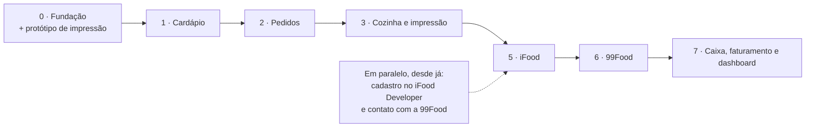

# 06 · Roadmap

Cada etapa entrega algo usável de ponta a ponta (backend, frontend e testes) e
só cria as tabelas que usa. Uma etapa só começa quando a anterior cumpre o
critério de pronto.

```mermaid
flowchart LR
    E0["0 · Fundação<br/>+ protótipo de impressão"] --> E1["1 · Cardápio"]
    E1 --> E2["2 · Pedidos"]
    E2 --> E3["3 · Cozinha e impressão"]
    E3 --> E5["5 · iFood"]
    E5 --> E6["6 · 99Food"]
    E6 --> E7["7 · Caixa, faturamento e dashboard"]
    P["Em paralelo, desde já:<br/>cadastro no iFood Developer<br/>e contato com a 99Food"] -.-> E5
```

> A ordem segue as prioridades do projeto. O restaurante-piloto só faz delivery,
> e o balcão usa a tela de novo pedido. Por isso a Etapa 4 (Salão) saiu do escopo
> ([D25](decisoes.md#d25--sem-salão-o-piloto-só-faz-delivery)) e a Etapa 5 (iFood)
> vem logo depois da impressão.

## Etapa 0 · Fundação

- Monorepo, `compose.yaml` (PostgreSQL), `.env.example`, CI no GitHub Actions
  (backend, frontend e smoke test contra PostgreSQL real).
- Backend: Spring Boot 4.1, migração inicial do Flyway, `ApiError` e handler
  central, segurança (JWT e refresh token), `store` e `app_user`,
  `StoreContext`, `Clock` injetado, OpenAPI e regras ArchUnit.
- Frontend: Vite + TypeScript, rotas, login, layout, cliente HTTP com renovação
  de token, tipos gerados do OpenAPI, MSW e tema Mantine.
- **Protótipo de impressão (1 dia):** o agente mínimo imprime um ticket com
  acentos, fonte dupla e corte nas impressoras reais do piloto.

**Pronto quando:** o login funciona de ponta a ponta. Um usuário de outra loja
recebe `404` no teste padrão de IDOR. O CI está verde. O protótipo imprimiu
certo nas impressoras do piloto.

> **Situação (set/2026):** tudo feito, com o fluxo validado num navegador real
> contra PostgreSQL. Falta o protótipo de impressão, que depende de saber
> marca, modelo e conexão (USB ou rede) das impressoras do piloto.

## Etapa 1 · Cardápio

- Setores, categorias, produtos (código PDV, preço, setor, disponibilidade),
  grupos de adicionais (mínimo, máximo, regra de preço) e opções.
- Telas de cadastro e "pausar item" rápido.
- Cálculo do preço de item com adicionais: soma, maior valor e média, para pizza
  meio a meio.

**Pronto quando:** o cardápio real do piloto, inclusive pizza meio a meio, está
cadastrado, e os testes de preço cobrem cada regra.

> **Situação (set/2026):** API, telas e testes prontos. O cardápio de uma
> pizzaria (meio a meio pelo sabor mais caro, borda, bebida indo para o Bar) foi
> montado num navegador real contra PostgreSQL, inclusive pelo celular, e o caixa
> consegue pausar e liberar itens. Falta cadastrar o cardápio real do piloto.

## Etapa 2 · Pedidos

- Clientes, endereços e taxa de entrega por bairro. Formas de pagamento.
- Tela de novo pedido (PDV) para retirada e delivery: adicionais com validação,
  observações, troco.
- Máquina de estados, linha do tempo, numeração diária com virada do dia
  operacional, cancelamento com motivo.
- Quadro de pedidos em tempo real (SSE) e histórico paginado com filtros.
- Registro de pagamento no pedido.

**Pronto quando:** um pedido de delivery com adicionais, taxa e troco percorre
todos os status, em duas telas abertas que se atualizam sozinhas. Os totais
batem nos testes.

> **Situação (set/2026):** API, telas e testes prontos. Num navegador real contra
> PostgreSQL, o caixa lançou um delivery com pizza meio a meio, dois
> refrigerantes, taxa do bairro e troco para R$ 100 (total R$ 74,90, troco de
> R$ 25,10). O pedido percorreu todos os status em três telas abertas (caixa,
> dona e cozinha), que se atualizaram sozinhas em menos de um segundo. A cozinha
> só consegue iniciar o preparo e marcar pronto. No pedido seguinte, o mesmo
> telefone trouxe o cliente e o endereço salvos. Os totais batem nos testes de
> unidade e de integração, e a numeração diária foi testada com 8 pedidos
> lançados ao mesmo tempo.

## Etapa 3 · Cozinha e impressão

- Tela da cozinha: tela cheia, filtro por setor, cronômetro, iniciar, pronto e
  desfazer.
- Agente v1: pareamento, impressora de rede e spooler do Windows, diário local,
  heartbeat, instalador MSI.
- Impressoras, setores e regras. Impressão automática. Layouts de 58 e 80mm.
  Reimpressão. Alertas de impressora offline. Painel de impressões. Contingência
  pelo navegador.

**Pronto quando:**
- Um pedido confirmado imprime no setor certo em menos de 3 s: bebida no bar,
  comida na cozinha, via completa no caixa.
- Desligar uma impressora gera alerta em menos de 1 min.
- Religar a impressora imprime os pendentes recentes e lista os expirados.
- Reiniciar o agente no meio de um trabalho não duplica nada.
- A reimpressão sai marcada.

> **Situação (set/2026):** a tela da cozinha está pronta
> (`GET /api/kitchen/orders?sectorId=`): tela cheia, filtro por setor guardado
> no aparelho, cronômetro verde, laranja (15 min) e vermelho (25 min), iniciar,
> pronto e desfazer ([D22](decisoes.md#d22--desfazer-da-cozinha-é-um-prazo-antes-de-gravar)),
> com a tela sem apagar. Num navegador real contra PostgreSQL, o filtro do Bar
> mostrou só as cervejas, um pedido lançado pela dona apareceu sozinho em menos
> de um segundo e o pedido pronto saiu da tela. Falta toda a parte de
> impressão, que depende de saber marca, modelo e conexão das impressoras do
> piloto.
>
> A impressão de contingência pelo navegador também está pronta: no detalhe do
> pedido, "Imprimir" gera a via completa ou o ticket de produção de cada setor,
> em papel de 58 ou 80mm, montados no servidor
> ([D23](decisoes.md#d23--impressão-pelo-navegador-desenha-as-linhas-prontas-do-servidor)).
> Uma loja pequena já opera sem agente. A cozinha só imprime produção.
>
> O protótipo do agente ([agent/](../agent/README.md)) está pronto para levar ao
> piloto: imprime a página de teste pela rede (9100) ou pelo spooler do Windows,
> com uma linha de acentos por tabela de caracteres, régua de colunas, fonte
> dupla e corte. Foi testado contra uma impressora falsa e empacotado com
> `jpackage` (roda sem Java instalado). Falta rodar nas impressoras reais e
> anotar o resultado de cada uma.
>
> Também estão prontos o pareamento do computador de impressão (código de 6
> dígitos e token de dispositivo em `/api/agent/**`), o heartbeat com o status de
> cada impressora e a tela **Configurações › Impressão**, com computadores,
> impressoras e a impressora de cada setor.
>
> A fila de impressão também está pronta no servidor: ao confirmar o pedido,
> nasce um trabalho de produção por setor (bytes ESC/POS com a tabela de
> caracteres e o corte da impressora) na mesma transação, com chave de
> idempotência, reserva de 2 min, nova tentativa com espera crescente, falha na
> 5ª tentativa, expiração em 20 min, impressora reserva quando a principal está
> fora e cancelamento dos pendentes quando o pedido é cancelado.
>
> O agente agora pareia (`parear`) e imprime a fila (`rodar`), com o diário
> local contra duplicidade e o trabalho incerto quando cai no meio. Ponta a
> ponta, com a API, o agente de verdade e uma impressora de rede falsa, o pedido
> confirmado chegou ao papel em 2,3 s, uma vez só.
>
> Painel de impressões pronto: faixa de alerta em todas as telas ("Impressora
> Cozinha offline: 3 impressões aguardando"), tela **Impressões** com o que
> falhou, ficou incerto ou expirou e o botão de imprimir de novo (na mesma ou em
> outra impressora), e reimpressão pelo detalhe do pedido com a faixa
> REIMPRESSÃO, sem duplicar no duplo clique.
>
> Pedido cancelado imprime "CANCELADO - NÃO PREPARAR" nos setores que já
> imprimiram. O CI gera o instalador MSI do agente, que na primeira abertura pede
> o endereço e o código e passa a abrir com o Windows. Com o executável
> empacotado, o pedido chegou ao papel em 0,8 s. O agente consulta a fila a cada
> 2 s em vez do aviso em tempo real
> ([D24](decisoes.md#d24--agente-consulta-a-fila-a-cada-2-s-sem-aviso-em-tempo-real)).
> Falta o que só dá para fazer na loja: rodar a página de teste e o fluxo nas
> impressoras reais do piloto (USB pelo Windows e rede) e medir o alerta de
> impressora desligada. Ficam para depois: serviço do Windows e ícone na bandeja.

## ~~Etapa 4 · Salão~~ (fora do escopo)

Mesas, comandas, rodadas, pré-conta e tela do garçom não serão construídas: o
piloto só faz delivery ([D25](decisoes.md#d25--sem-salão-o-piloto-só-faz-delivery)).
O modelo continua com ponto de encaixe se um dia entrar um cliente com salão.

## Etapa 5 · iFood

- Credenciais do aplicativo centralizado, token e vínculo da loja com
  verificação.
- Polling com inbox, ingestão, outbox de status e reconciliação.
- Cancelamento com motivos, negociação (disputas com prazo), mapeamento por
  código PDV e painel de saúde.
- Webhook assinado em produção, com polling de contingência.
- Homologação.

**Pronto quando:** a homologação foi aprovada. Um pedido de teste percorre
aceite, cozinha, impressão, pronto e conclusão, com o status refletido no iFood.
Um cancelamento do cliente imprime o aviso na cozinha.

> **Situação (set/2026):** a integração está pronta no software e testada pelo
> simulador, sem credenciais. Tem vínculo da loja com o merchant, polling a cada
> 30 s em lotes de 100 com ack depois de gravar, inbox deduplicado, importação do
> pedido (itens pelo código PDV, desconto por quem paga, pagamento online ou na
> entrega com troco) e outbox que manda aceite, preparo, pronto e despacho em
> ordem, com nova tentativa. O cancelamento é pedido ao iFood com os motivos
> dele, e o pedido só é cancelado aqui quando o iFood confirma. Há ainda o painel
> de saúde, o aceite automático opcional e o selo "iFood 7391" no quadro e no
> ticket. Com a API rodando no PostgreSQL e o simulador ligado, o pedido
> apareceu no quadro em 1,7 s, já aceito, com o aceite devolvido ao "iFood" e o
> ticket na fila da cozinha.
>
> Falta: credenciais do iFood Developer (aplicativo centralizado) para testar
> contra o iFood de verdade, conferir os caminhos do polling e do ack na
> homologação
> ([D26](decisoes.md#d26--integração-com-o-ifood-sem-credenciais-simulador-e-caminhos-configuráveis)),
> negociação (disputas) e a homologação.
>
> Webhook assinado: pronto em `POST /api/integrations/ifood/webhook`, sem login.
> Confere o HMAC-SHA256 do corpo cru com o client secret
> (`X-IFood-Signature`, comparação em tempo constante), grava no mesmo inbox do
> polling e responde 202. Assinatura errada: 401 e nada gravado. O polling
> continua ligado como contingência e o inbox deduplica o que chega pelos dois.
> Reconciliação: o próprio polling a cada 30 s recupera eventos perdidos pelo
> webhook; uma consulta periódica do status dos pedidos abertos fica para a
> homologação, quando der para ver se os detalhes do pedido trazem o status.

## Etapa 6 · 99Food

- Adaptador Open Delivery, vínculo da loja e o mesmo fluxo de entrada e saída.
- Credenciamento e validação com a 99Food.

**Pronto quando:** o pedido de teste da 99Food percorre o fluxo completo, com
status sincronizado.

## Etapa 7 · Caixa, faturamento e dashboard

- Caixa: abertura, sangria, suprimento, fechamento com conferência por forma de
  pagamento e relatório impresso.
- Faturamento por período, canal, tipo e forma de pagamento. Ticket médio,
  cancelamentos, taxa de serviço e taxa de entrega em linhas separadas.
- Dashboard do dia: pedidos, faturamento, tempo médio de preparo, pedidos por
  hora e produtos mais vendidos.

**Pronto quando:** nos testes, o fechamento de caixa bate com os pagamentos do
dia, e os números do dashboard conferem com uma consulta manual.

> **Situação (set/2026):** pronto. Telas **Caixa**, **Painel do dia** e
> **Faturamento**; relatório de caixa na impressora térmica. O critério de pronto
> é o `CashAndReportsIntegrationTest`: o esperado do fechamento bate com a soma
> dos pagamentos no banco, e o painel e o faturamento batem com consultas diretas.
> Fica para depois: contagem "às cegas" (hoje quem fecha vê o esperado) e
> gráficos além das barras por hora.

## Etapa 8 · Cardápio digital PedeAí (em andamento)

Decisões (out/2026): mesmo backend e mesmo projeto do frontend, com uma página
separada (`menu.html`, rota `/loja/:slug`) para o cliente final. Pagamento na
entrega ou na retirada por enquanto; um endereço por loja dentro do PedeAí.

Plano:

- Nova origem `DIGITAL_MENU`. Trocar as checagens `source != PEDEAI` por
  `OrderSource.isMarketplace()` (status, cancelamento e pagamento), senão o
  pedido do cardápio seria tratado como iFood.
- Loja ganha `slug` (único) e `menu_open` (recebendo pedidos pelo cardápio),
  com chave no quadro de pedidos para quem está no caixa.
- Módulo `storefront`, público: cardápio da loja, pedido (preço e taxa de
  entrega calculados no servidor, nasce **Recebido** para o aceite no quadro,
  limite por IP) e acompanhamento por um código aleatório do pedido.
- Depois: API de pedidos com chave por loja, Open Delivery (cardápios de
  terceiros e 99Food) e importação de cardápio (iFood e planilha).

## Depois do escopo atual

Nada disto será construído agora. Tudo tem ponto de encaixe (ver
[02 · Arquitetura](02-arquitetura.md#evolução-onde-os-módulos-futuros-se-encaixam)):

- Estoque e ficha técnica
- Emissão fiscal (NFC-e)
- Financeiro completo e repasses de marketplace
- Delivery próprio (entregadores, despacho, acerto)
- Cardápio digital e pedido online próprio
- Sincronização de cardápio e pausa da loja nos marketplaces
- Outras plataformas Open Delivery
- Relatórios avançados, redes com várias lojas, fidelidade, avisos por WhatsApp
- Agente Android, venda por peso, modo offline
